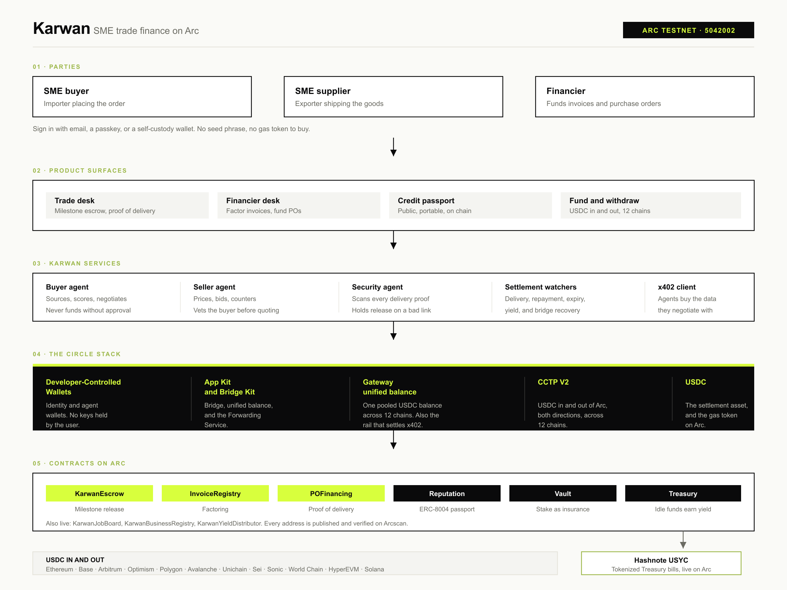

# Karwan

A settlement and credit layer for cross-border SME trade. Money sits in milestone escrow and releases against delivery. Every settled deal writes to a credit record that belongs to the business and travels with it, so a supplier finishes their first shipment with cash in hand and a credit file a financier can read.

Built on the Circle stack. Live on Arc Testnet (chain 5042002), where USDC is the gas token.

Live at [karwan.site](https://karwan.site). API at [api.karwan.site](https://api.karwan.site).



## The problem

A supplier in Lagos ships cotton to a buyer in Dubai. The goods leave in a week. The money arrives in ninety days, if it arrives. In between sits a correspondent banking chain that charges for every hop, a letter of credit most small exporters cannot get, and a working-capital hole the supplier funds out of pocket or not at all.

The financing exists. It does not reach them. A bank underwrites against a credit file a first-time exporter does not have, and the trade record that would build one is scattered across invoices, emails, and bank statements no lender can verify.

Karwan gives that trade a settlement layer and a credit history at the same time. The trade is the underwriting.

## What is live

### Milestone escrow for import and export settlement

A deal splits into two to five milestones. The supplier marks a milestone delivered, the buyer reviews and releases that portion. The final milestone always needs an explicit buyer click and never releases on a timer. A missed deadline lets the buyer reclaim, and it counts against the supplier's record. A cancel or extension both sides agree to carries no penalty and refunds in full.

The platform fee is 1.5 percent of the deal, split evenly between the two sides.

### Invoice factoring

A financier advances against an invoice at a discount tied to the supplier's reputation tier. The supplier is paid early. On settlement the contract pulls the agreed repayment, so the financier does not chase it. Both legs move native USDC.

### Purchase-order financing

Working capital advanced against an accepted purchase order and held in contract custody. Proof of delivery is attested on chain by an allowlisted attester, and that attestation is what releases the capital to the supplier. A watcher drives release and repayment without a human in the loop.

### The credit passport

A public page per business at `/credit-passport/[address]`, built from settled deals, repayment behaviour, and counterparty concentration. Reputation is value-weighted and counts distinct settled counterparties, so volume with one repeat partner cannot inflate a score. It follows the wallet, not the platform.

It is also a paid endpoint. Any lender can pay a fraction of a cent over x402 and read a verifiable settled-deal record without asking Karwan for permission. That is what makes it a passport rather than a profile.

### Agents that negotiate with market context

An SME cannot afford to staff a sourcing desk. The agents do that work.

- **Market research, shared.** Before negotiating, an agent spends a fraction of a cent over Circle's x402 surface to pull a live market read: a web search plus a grounded price. The read is shared, so both agents negotiate against the same number instead of guessing.
- **Best fit first.** Ranking leads with skill and topical fit. Reputation only breaks ties between comparable matches, so a strong specialist is never buried under a higher-reputation generalist.
- **Proceed or pass, never a silent no.** When the best achievable price lands just outside the buyer's range, the agent surfaces it with the market reason attached instead of declining behind their back. Nothing funds until a human approves.
- **Counterparty vetting.** A buyer agent pulls a seller's settled-deal record before scoring their bid. A seller agent pulls the buyer's funded-deal record before pricing. Each side pays for the read on the deals they actually match.
- **Human approval always.** An agent never opens or funds an escrow without an explicit click. New and low-reputation counterparties route to human review, never an automatic decline.

### Delivery safety

Work changes hands through links, and links are where fraud hides. A SecurityAgent scans every delivery proof before the buyer sees it, and guards the in-app chat so a phishing or malware link cannot be sent in the first place. A flagged link pauses the deal's automatic release, notifies both sides, and routes them to resolve it in chat. A confirmed bad link is a heavy hit to the sender's reputation.

### USDC in and out, across twelve chains

USDC moves into and out of Arc in both directions across twelve chains, including Solana. Outbound settlement uses Circle's Forwarding Service to submit the destination mint, so a supplier cashes out anywhere without ever holding that chain's gas token.

Circle Gateway gives a business one pooled USDC balance across those chains. Deposit once, then spend to any chain from a single signature, with no chain switching and no source-chain gas.

### Staking that doubles as deal insurance and earns yield

A staker locks USDC into KarwanVault, and the same principal does two jobs.

- **Deal insurance.** When a seller accepts a deal, the escrow reserves a portion of their free stake against it. A lost dispute slashes that reservation to the buyer.
- **Yield on idle balances.** Idle USDC routes into Hashnote USYC on Arc through KarwanTreasury, an ERC-4626 contract that subscribes to USYC and redeems on demand, marked to the live on-chain oracle. The treasury holds real allowlisted USYC today.

## Roadmap

### The v2 contract bundle

A second contract generation is written, tested, and reviewed internally. It ships as one immutable release after review rather than a mid-cycle redeploy, so the live deployment stays stable while the bundle is finished. It lands in the coming weeks.

- A contract-level guardian places bounded, auto-expiring holds and records delivery attestation across the escrow, vault, treasury, and financing contracts. It can pause a settlement but never move funds.
- Arbiter dispute resolution with proportional splits, and a seller claim path after a review window.
- Deal timing on chain: consented per-deal clocks, a capped seller-appeal extension flow, and a match window.
- Reputation hardened against farming, weighting standing on distinct settled counterparties so volume against one repeat party cannot inflate a score.

### Skill verification

An agent ranks a seller on what they claim plus their settled-deal record. The next layer proves the claim, without Karwan running assessments itself. Partners do the verifying, Karwan reads the proofs. A seller proves a fact about a partner account through a zero-knowledge proof, so the account is never exposed and only a salted commitment lands on chain.

### Mainnet

User funds move to user-held wallets, with agents funded only through a capped spend allowance, so the platform never custodies a principal. Staker deposits route to USYC so stakers earn yield directly.

### Fiat rails

On and off ramps through the Circle Payments Network, so a business funds a deal and cashes out in local currency through partner institutions without going through an exchange. The aim is onboarding and payout that feel like ordinary software, with the settlement layer kept out of sight.

## Contracts on Arc Testnet (chain 5042002)

| Contract | Address |
|---|---|
| KarwanEscrow | `0x48797C04EE342067A68f29Fbb19B577077d77301` |
| KarwanInvoiceRegistry | `0x20a7CDf59b5f304De2b22a75e49f52353273E4E4` |
| KarwanPOFinancing | `0xc91122Eb88613C98d58616cD8973883142F74Bb5` |
| KarwanReputation | `0xBBAC748cA8C7a47e39Bd2AEaDbaa4e9f96ae4442` |
| KarwanVault | `0x2d4506284B2D778365b4B295100EF099F35973c5` |
| KarwanTreasury | `0x9d95E4810E7C8B815F1Fb1Ec02C19085f8C76573` |
| KarwanBusinessRegistry | `0xc64d347c9Fe451A3f1c8f4cF2d7a2E43D9AA771e` |
| KarwanJobBoard | `0x35224C2234263B5506a9F7BfF4bb98e9FceD3FF3` |
| KarwanYieldDistributor | `0x9950b9a41A3e80930e451F2FEdaeb81e80195D03` |
| USDC | `0x3600000000000000000000000000000000000000` |

Hashnote USYC on Arc Testnet, verified against Circle's published addresses.

| Contract | Address |
|---|---|
| USYC Token | `0xe9185F0c5F296Ed1797AaE4238D26CCaBEadb86C` |
| USYC Teller (USDC) | `0x9fdF14c5B14173D74C08Af27AebFf39240dC105A` |
| USYC/USD Oracle | `0x52b56c7642E71dc54714d879127d97cd0B3D4581` |
| USYC Entitlements (RolesAuthority) | `0xcc205224862c7641930c87679e98999d23c26113` |

Earlier contract generations stay registered so users with open positions can find and exit them under `/legacy`. Nothing on a retired contract gets stuck.

## The Circle stack

| Circle product | Role in Karwan |
|---|---|
| USDC on Arc | The settlement asset for escrow, milestone release, factoring, purchase-order custody, repayment, staking, and fees. On Arc it is also the gas token, so a business never buys a second asset to move its own money. |
| Developer-Controlled Wallets | An identity wallet and two agent wallets per user, provisioned on sign-in with an email or a passkey. No seed phrase. Web3 users can sign in with their own wallet through Sign-In with Ethereum instead. |
| CCTP V2 with App Kit | USDC into and out of Arc across twelve chains, both directions. Outbound uses Circle's Forwarding Service to submit the destination mint. |
| Circle Gateway | One pooled USDC balance across twelve chains, spendable to any of them from a single signature. Also the settlement rail for x402, netting the agents' per-call payments into batched on-chain settlement. |
| Gateway Nanopayments (x402) | Agents buy the data they negotiate with, a cent at a time. Karwan also sells five paid endpoints, including the credit passport and repayment behaviour. |
| Hashnote USYC | On-chain yield on idle balances, sourced from tokenized Treasury bills. Real allowlisted USYC, marked to the live oracle. |

## How it is built

A Next.js frontend and a Hono backend sit above the Circle SDKs. The backend holds no user funds: it provisions Circle wallets, relays what needs relaying, and runs the watchers that drive delivery, repayment, expiry, and yield. The contracts are the source of truth, and every settlement event links to Arcscan from the live activity feed at `/activity`.

Contracts are Solidity, tested with Foundry: **362 tests passing across 28 suites**, including conservation and vault invariant suites and named attack suites for escrow timing, vault reentrancy, and reputation farming.

```bash
cd contracts && forge test
```

## Docs

- [docs/architecture.md](./docs/architecture.md). Components, the deal flows, the wallet model.
- [docs/circle-integration.md](./docs/circle-integration.md). Each Circle product and where it lands in the code.
- [docs/reputation-model.md](./docs/reputation-model.md). The composite score, tier breakpoints, and agent integration.
- [docs/why-karwan.md](./docs/why-karwan.md). The longer design brief.
- [docs/circle-product-feedback.md](./docs/circle-product-feedback.md). Notes from building on Circle.

## License

MIT.
