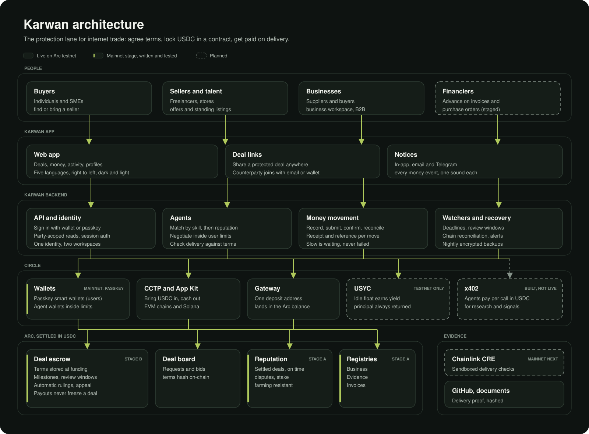
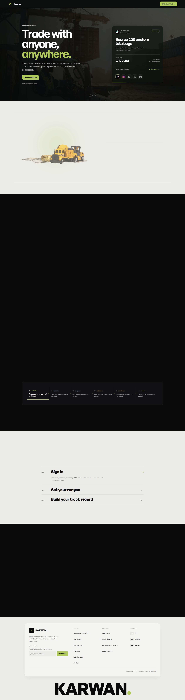
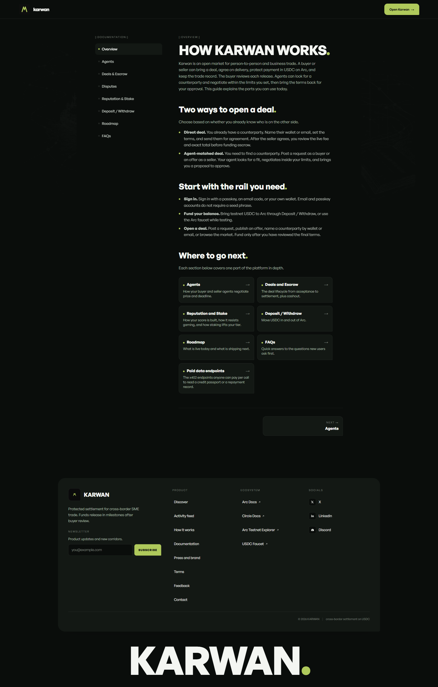
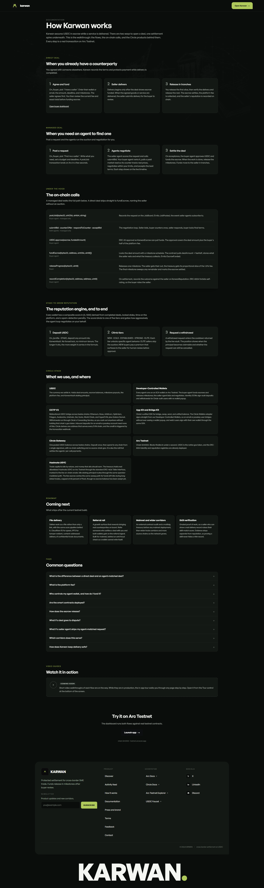

# Karwan

**Trade can start anywhere. Settlement should not depend on trust alone.**

Karwan is building an open market for secure local and cross-border trade. Two people or businesses can meet on a social network, in a marketplace, through chat, or in person, then move the agreement into one protected flow: set the terms, secure USDC in milestone escrow, verify delivery, release payment, and leave both sides with a portable trade record.

That record also supports Karwan's implemented financier, invoice-factoring and
purchase-order financing paths. Availability depends on deployment flags and
eligibility; their presence in source is not a promise of available credit.

The current build runs on Arc Testnet (chain `5042002`), where USDC is also the gas token. It is live at [karwan.site](https://karwan.site), with the API at [api.karwan.site](https://api.karwan.site).

Karwan is testnet software. Testnet USDC has no real value. Do not use the build for real funds or treat it as a regulated financial, identity, employment, lending, or payout service.

Karwan answers two trust questions in one trade flow: what happened, and who is behind an automated action. Arc is the settlement record. Chainlink CRE checks delivery evidence before release decisions. World ID and AgentKit provide an optional human-backed identity signal for agent and research workflows. The buyer still approves the agreed outcome.

For higher-risk or higher-value deals, a buyer can add a **high-signal identity
requirement** to the agreement. The buyer chooses whether the seller, the buyer,
or both parties must complete a World ID Selfie Check (Beta) before the seller
can accept or the buyer can fund. Selfie Check uses the user's device camera and
does not require Orb access. The deal page opens the official World ID request widget;
Karwan uses World ID v4 sessions for returning users: each deal requires a fresh
proof bound to its account, role, agreement version, nonce and environment.
PostgreSQL commits the private account/session binding, replay receipt and deal
result in one transaction. The public deal stores a one-way proof reference,
not the private session identifier. Existing uniqueness/action replay records
remain separate and are not cleared. Karwan does not store biometric data. This check is an additional
trust signal. It does not approve payment, release escrow, or decide a dispute.
If World credentials are unavailable, the deal remains blocked and shows a
recoverable status instead of treating the party as verified.

The session implementation requires migration 28 and a World tenant with v4
Selfie access. Local database tests cover two-deal continuity, replay, expiry,
restart and rollback using a provider fixture. A real returning-user Sandbox
run is still a release gate, not a result claimed by those tests. Historical
receipts remain stored; checks without the current agreement/environment binding
must be completed again before they satisfy acceptance or funding requirements.

## The market Karwan is building

Karwan brings four jobs into one system:

1. **Capture the trade where it starts.** A planned browser companion will let a user draft a deal beside X, TikTok, Facebook, Instagram, LinkedIn, or another website. The counterparty will be able to review and accept through a normal Karwan link without installing anything.
2. **Secure performance, not just payment.** The parties agree the amount, milestones, evidence, deadline, cancellation path, and dispute path before funds are locked.
3. **Settle across borders in USDC.** Escrow releases only against the agreed outcome. CCTP and Circle Gateway handle supported on-chain routes. Local-currency bank payout is planned per corridor through approved, regulated payout infrastructure, with fees and foreign exchange shown before confirmation.
4. **Make eligible trade easier to finance.** Financier quotes, invoice factoring
   and purchase-order financing build on trade records and settlement history.
   These paths are implemented and gated; production availability must be checked
   against the deployed configuration and eligibility rules.

The flywheel is simple: more protected trades create better records; better records make financing easier to price; more available capital helps more trades complete.

## What exists and what is planned

| Layer | Arc Testnet today | Planned expansion |
|---|---|---|
| Trade entry | Direct deals, email invites, business requests, offers, and agent-assisted matching in the Karwan web app | A user-invoked browser companion that can start a protected trade beside any supported site, with X as the first focused surface |
| Protection | Milestone escrow, delivery review, cancellation, extension, dispute resolution, and settlement receipts | Source-aware trade drafts, stronger evidence capture, and corridor-specific policy controls |
| Settlement | USDC on Arc, CCTP routes, Circle Gateway, wallet and bridge surfaces | Mainnet release after audit and control gates; local bank payout through approved corridors and partners |
| Trade finance | Implemented financier, invoice-factoring and purchase-order financing paths, subject to deployment flags and eligibility | Broader underwriting and funding access after policy, liquidity and mainnet gates pass |

The browser companion, mainnet settlement, and local bank payout are roadmap items, not capabilities in the current testnet release.



## One account, two workspaces

The current identity model is one person and one login. Every account starts
with a personal workspace. An owner can add a business workspace under that
same identity without creating a second account, wallet, or USDC balance.
Workspace context is visible before sensitive actions. Business verification
is separate from personal identity verification. The current business
workspace is owner-only; team permissions are on the roadmap.

## Current UI snapshots

These images were captured from the local build on 2026-09-09 and show the
public landing page, documentation index, and How Karwan Works page.







## What the build covers

- Personal trade surfaces and a business workspace focused on Find supply, Post what we offer, and Bring a deal.
- Direct deals with a named counterparty, plus agent-assisted matching and negotiation. Money never moves without a human approval or a contract-defined automatic outcome.
- A Postgres-backed agent runtime with versioned mandates and offers, deterministic matching, evidence and staking gates, idempotent financial commands, ordered event replay, dead letters, and failure-injection rollout checks. V2 behaviors stay behind independent default-off flags until their review gates pass.
- Milestone escrow with delivery review, cancellation, mutual extension, and dispute outcomes enforced by the contracts.
- Business availability records for goods and services, business verification status, reputation, and trade history.
- Reputation, staking, tier progression, and yield surfaces.
- Idle balances routed into Hashnote USYC, tokenized Treasury bills, through an ERC-4626 Teller. Real allowlisted USYC rather than a mock: the token is permissioned, so holding any at all is the proof.
- Five paid data endpoints served over x402 and settled through Circle Gateway Nanopayments, so a lender can read a settled-deal record without asking Karwan for access.
- USDC into and out of Arc over CCTP across eleven EVM testnets and Solana devnet, plus a Circle Gateway unified balance spendable from one signature.
- Activity, wallet, bridge, profile, settings, and unified personal and business workspaces.
- Business registration and a verification status workflow.
- A reusable trust boundary: authenticated evidence delivery and release gates through Chainlink CRE, plus World ID staging verification, AgentKit challenge protection, and World AgentBook lookup for agent workflows.
- High-signal direct deals with party selection (seller, buyer, or both), signed World ID session requests, per-proof replay protection, agreement-version binding, party-scoped verification status, and durable verification receipts. The gate protects acceptance and funding while leaving final money decisions with the parties and the escrow contract.
- Interface in English, Arabic, French, Hindi, and Swahili, with right-to-left layout for Arabic.

Some integrations and policy controls sit behind configuration flags. A capability is live only when the product exposes it and the backend and contract paths behind it are switched on.

## Run it locally

[SETUP.md](./SETUP.md) has the full walkthrough, including Circle wallet provisioning on first run. The short version:

```bash
npm install
cp .env.example .env    # fill in the keys listed in SETUP.md
npm run dev             # backend on :8787, frontend on :3000
```

The frontend will start on its own, but every deal, balance, and activity surface reads from the API, so run both.

```bash
npm run typecheck       # backend + frontend
npm run build           # production build of both
cd contracts && forge test
```

## Repository map

| Path | What it holds |
|---|---|
| `frontend/` | Next.js app and the product surfaces. |
| `backend/` | Hono API, the buyer and seller agents, the watchers, and the Circle SDK wiring. |
| `contracts/` | Foundry project for the Arc contracts and their deploy scripts. |
| `docs/` | Architecture, reputation model, Circle integration, and the platform terms. |

## Contracts on Arc Testnet (chain 5042002)

| Contract | Address |
|---|---|
| KarwanJobBoard | `0x35224C2234263B5506a9F7BfF4bb98e9FceD3FF3` |
| KarwanEscrow | `0x0262A4dFec0E057cAf80F124BfD2847581E82B63` |
| KarwanReputation | `0x8bD35853b986a04EfDED7F863AFF34826fde69eE` |
| KarwanVault | `0xA600Bd772A032Ec2b96a9A44545024E270418927` |
| KarwanTreasury | `0x5a642BE344Fc3a01999bF113197ddC1A163EE837` |
| KarwanYieldDistributor | `0x9E4AdFcfB46108ED7c2F3C1AF1728AAE937f336F` |
| KarwanInvoiceRegistry | `0xFb0Debd5E2618881699ED9b02CE0c9B718a1C649` |
| KarwanPOFinancing | `0xE87ef70E19FA8BbfdC04b9310371A7006B86b60A` |
| KarwanBusinessRegistry | `0x77F4a1Cc4C1F7BB35b23db679966b33b8d8b27cf` |
| USDC | `0x3600000000000000000000000000000000000000` |

One address sits outside the bundle. The fee reserves that hold Hashnote USYC live in an earlier treasury, `0x9d95E4810E7C8B815F1Fb1Ec02C19085f8C76573`, because a Hashnote entitlement is granted to a specific address and does not carry over when a contract is redeployed. Anyone checking the USYC position should read that address rather than the bundle treasury.

Retired contract generations stay registered so users with open positions can still find and exit them under `/legacy`. Fifty-five deployments across nine contract types have gone out over the life of the project; `/activity/all-time` totals every one of them and links each address to the explorer.

## The Circle stack

Karwan uses the complete Circle Agent Stack across application runtime and
operator tooling. The custody boundary is intentional: Circle Agent Wallets
handle isolated operator research and Marketplace payments, while customer deal
automation continues through Karwan's Developer-Controlled Wallet SCAs.

| Product | Role in Karwan |
|---|---|
| Circle CLI | Operator interface for Agent Wallet login, wallet policy checks, CCTP and Gateway smoke tests, paid-service calls, and Circle Skill management. The public API never shells out to the CLI. |
| Agent Wallets | User-custody wallets with spending and recipient policies for operator-controlled research and Agent Marketplace payments. They are isolated from customer deal wallets. |
| Agent Marketplace | The Discovery API supplies the current paid x402 service catalogue, schemas, networks, prices, and payment metadata. It is not Karwan's people or SME counterparty directory. |
| Circle Skills | Installed build and operations knowledge for wallet policy, funding, CCTP, Gateway, and nanopayment workflows. Karwan's runtime policy remains versioned and tested in this repository. |
| USDC on Arc | The settlement asset for escrow, milestone release, staking, and fees. On Arc it is also the gas token, so a customer never buys a second asset to move its own money. |
| Developer-Controlled Wallets | An identity wallet and two agent wallets per user, provisioned on sign-in with an email or a passkey. Web3 users sign in with their own wallet through Sign-In with Ethereum instead. |
| CCTP V2 through App Kit | USDC into and out of Arc in both directions. Outbound uses the Forwarding Service to submit the destination mint, so a supplier cashes out without holding that chain's gas token. |
| Circle Gateway | One pooled USDC balance across chains, spendable to any of them from a single signature. Also the settlement rail for x402, netting per-call payments into batched on-chain settlement. |
| Agent Nanopayments (x402) | Agents make gas-free, batched USDC payments when a service supports Circle Gateway. The explicit standard x402 rail remains available for providers that do not. Karwan also sells five endpoints: credit passport, repayment behaviour, concentration, document anchors, and skill demand. |
| Hashnote USYC | On-chain yield on idle balances, from tokenized Treasury bills, marked to the live oracle. |

See [agent workflows](./docs/agent-workflows.md) for the complete intent,
matching, evidence, negotiation, approval, execution, reconciliation, and replay
flow. See [Circle Agent Marketplace service policy](./docs/circle-agent-marketplace-services.md)
for the Discovery API boundary and provider order.

## Tests

`forge test` runs 423 contract tests across 36 suites. That includes conservation and vault invariant suites, and attack suites written against escrow timing, vault reentrancy, reputation farming, and the trade-finance design.

```bash
cd contracts && forge test
```

The backend suite runs with `npm test --workspace=backend` and needs a populated `.env`, because one route test resolves live contract addresses.

## Documentation

- [SETUP.md](./SETUP.md) for running it locally and provisioning Circle.
- [CIRCLE.md](./CIRCLE.md) for how each Circle product is used.
- [docs/architecture.md](./docs/architecture.md) for components, the wallet model, and the deal flows.
- [docs/agent-workflows.md](./docs/agent-workflows.md) for the reliable agent runtime, rollout flags, and human authority boundaries.
- [docs/reputation-model.md](./docs/reputation-model.md) for how standing is scored.
- [docs/circle-integration.md](./docs/circle-integration.md) for integration detail per product.
- [docs/circle-agent-marketplace-services.md](./docs/circle-agent-marketplace-services.md) for paid evidence discovery and provider policy.
- [docs/terms-and-conditions.md](./docs/terms-and-conditions.md) for the terms users accept in product.
- [docs/why-karwan.md](./docs/why-karwan.md) for the problem the build is aimed at.
- [docs/trust-and-proof.md](./docs/trust-and-proof.md) for how Arc, Chainlink CRE, and World ID work together across different deal types.
- [contracts/README.md](./contracts/README.md) for building, testing, and deploying the contracts.
- [RELEASE_NOTES.md](./RELEASE_NOTES.md) for what changed and when.

## Roadmap

### Trade Anywhere and the open finance market

The next product expansion moves trade creation closer to the conversation without moving financial authority into a social network. It is planned in this order:

1. **One source-agnostic trade draft.** Add a versioned trade-intent model for services, goods, purchase orders, and invoices. It records user-approved terms and an optional source reference, not a copy of a private conversation.
2. **A universal browser companion, starting with X.** Open Karwan in a Manifest V3 side panel after a user gesture. The first store version uses temporary `activeTab` access, does not scrape messages, does not inject buttons, and never posts, follows, likes, replies, or sends messages for the user. TikTok, Facebook, Instagram, LinkedIn, and other sites enter through the same generic capture path. Platform-specific extraction or APIs remain disabled until their terms and review requirements are satisfied.
3. **Counterparty consent on the web.** The other party receives a secure invite, reviews the exact commercial and settlement terms, accepts or counters, and can complete the flow without the extension. Terms become immutable after acceptance.
4. **Settlement and evidence.** Funding, delivery, disputes, release, receipts, and reputation continue through Karwan's existing reviewed-command and contract boundaries. The extension is another client, never a second ledger or wallet authority.
5. **Financing on verified trade.** Start with accepted Karwan-originated invoices and purchase orders. Approved financiers quote advances, sellers compare the amount now, repayment, spread, expiry, and recourse, then choose whether to assign the receivable. The settlement redirect repays the financier before the residual reaches the seller.
6. **Local payout corridors.** Keep USDC as the settlement layer while approved payout infrastructure converts to local currency and pays a supported bank account. Each corridor launches only after availability, compliance, reconciliation, refund, support, fee, and foreign-exchange gates pass.

This is not a social-engagement marketplace. Karwan will not pay people to like, follow, repost, comment, or manipulate activity on another platform. It secures commercial agreements that happen to begin there.

### Arc mainnet readiness

Karwan is operating on Arc Testnet. Mainnet is a controlled release program,
not a network switch. Real-value settlement will remain disabled until the
contract, operator, financial-command, deployment, recovery, and dependency
gates below have reproducible evidence and pass a documented go/no-go review.

| Gate | Required outcome | Current status |
|---|---|---|
| Contract assurance | The exact release candidate receives independent review, static analysis, adversarial and invariant testing, remediation, and auditor closure with no unresolved critical or high finding. | Required before mainnet |
| Deployment integrity | Audited source reproduces deployed bytecode. A signed manifest records addresses, code hashes, constructor inputs, roles, compiler settings, creation blocks, and explorer verification. | Required before mainnet |
| Multisig authority | Administrator, guardian, treasury, pauser, operator, and upgrade powers are assigned to documented multisig and timelock controls. Personal deployer keys retain no production authority. | Required before mainnet |
| Operator security | Named operator identities, phishing-resistant MFA, least-privilege RBAC, scoped machine credentials, separation of duties, revocation, and attributable audit records replace the shared admin-token model. | Required before mainnet |
| Financial command authority | One durable reviewed-command boundary owns funding, release, refund, financing, repayment, staking, bridging, and cash-out initiation. Authorizations are exact, versioned, expiring, and idempotent. | Foundations built; authority cutover pending |
| Finality and reconciliation | Completion requires receipt, finality, exact transfer, recipient, amount, and contract-state verification. Unknown, replaced, reverted, and delayed operations reconcile before any retry. | Foundations built; mainnet proof pending |
| Immutable release and rollback | Releases are digest-pinned and linked to Git, migrations, frontend, contracts, SBOM, and provenance. Readiness gates traffic, and unsafe canaries roll back automatically. | Required before mainnet |
| Workflow and recovery proof | Isolated buyer, seller, financier, dispute, and operator E2E suites cover success, duplicate, restart, provider, database, RPC, webhook, and stale-state scenarios on mobile and desktop. | Required before mainnet |
| Dependency risk | Every critical or high production advisory is remediated or covered by a dated, owned, time-bounded risk acceptance with reachability and compensating-control evidence. | Zero critical; four high families under review |

### Delivery sequence

1. **Assure the contracts.** Freeze the candidate, run static analysis, complete
   independent review, close findings, and reproduce the deployment bytecode.
2. **Establish the control plane.** Put contract roles behind multisig controls
   and replace shared administration with named operators, MFA, RBAC, scoped
   credentials, and separation of duties.
3. **Cut over financial authority.** Move each money operation to the durable
   reviewed-command and reconciliation path only after shadow parity, duplicate
   safety, restart recovery, kill-switch, and rollback evidence pass.
4. **Prove the release system.** Deploy immutable artifacts through readiness
   and canary gates, exercise automatic rollback and database restore, and
   retain a signed evidence pack for the release.
5. **Rehearse the product.** Run complete buyer, seller, financier, dispute, and
   recovery workflows twice from clean state in a mainnet-like environment.
6. **Make the release decision.** Security, engineering, product, and operations
   review every P0 artifact. Mainnet remains disabled unless the decision is an
   explicit go.

### Beyond the mainnet gate

After the browser companion and mainnet control gates, a mobile companion can
cover frequent actions: opening a shared trade invite, reviewing a counter,
funding or releasing a milestone, answering a deadline, and checking where a
deal stands. Detailed operations, business controls, verification review, and
full activity history remain on the web. The mobile application is planned work
and does not ship in the current testnet release.

## License

See [LICENSE](./LICENSE).
