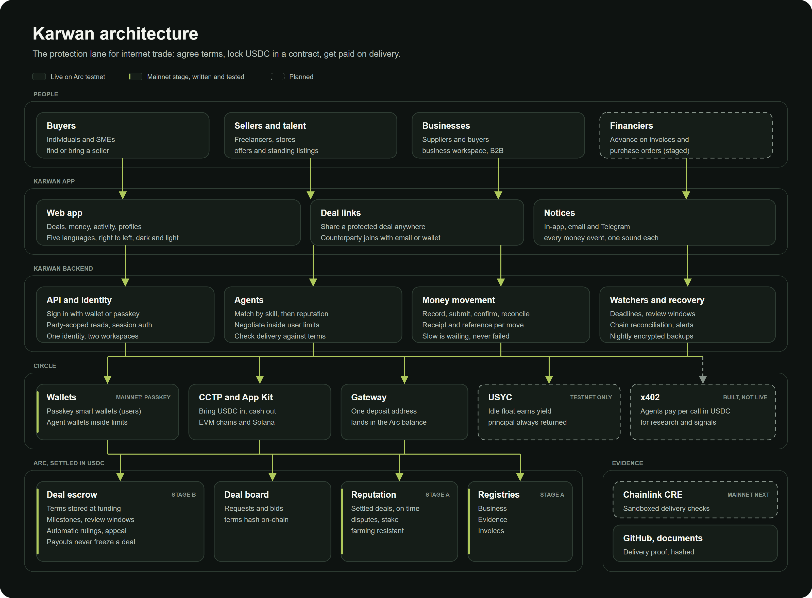

# Karwan

Karwan is an on-chain settlement and reputation workspace for person-to-person and business trade. Two parties agree terms, fund USDC escrow on Arc, and release money as delivery is accepted. Every settled deal writes to a record that belongs to the wallet rather than to Karwan.

The build runs on Arc Testnet (chain `5042002`), where USDC is the gas token. Live at [karwan.site](https://karwan.site), with the API at [api.karwan.site](https://api.karwan.site).

Karwan is testnet software. Do not use it for real funds, and do not treat it as a regulated financial, identity, or employment service.



## What the build covers

- Buyer and Seller desks for individual trade, Buyer Desk and Supply Desk for business trade.
- Direct deals with a named counterparty, plus agent-assisted matching and negotiation. Money never moves without a human approval or a contract-defined automatic outcome.
- A Postgres-backed agent runtime with versioned mandates and offers, deterministic matching, evidence and staking gates, idempotent financial commands, ordered event replay, dead letters, and failure-injection rollout checks. V2 behaviors stay behind independent default-off flags until their review gates pass.
- Milestone escrow with delivery review, cancellation, mutual extension, and dispute outcomes enforced by the contracts.
- Invoice factoring and purchase-order financing, a financier desk, and a public credit passport per business address.
- Reputation, staking, tier progression, and yield surfaces.
- Idle balances routed into Hashnote USYC, tokenized Treasury bills, through an ERC-4626 Teller. Real allowlisted USYC rather than a mock: the token is permissioned, so holding any at all is the proof.
- Five paid data endpoints served over x402 and settled through Circle Gateway Nanopayments, so a lender can read a settled-deal record without asking Karwan for access.
- USDC into and out of Arc over CCTP across eleven EVM testnets and Solana devnet, plus a Circle Gateway unified balance spendable from one signature.
- Activity, wallet, bridge, profile, settings, and business-account workspaces.
- Business registration and a verification status workflow.
- Interface in English, Arabic, French, Hindi, and Swahili, with right-to-left layout for Arabic.

Some integrations and policy controls sit behind configuration flags. A capability is live only when the product exposes it and the backend and contract paths behind it are switched on.

## Run it locally

[SETUP.md](./SETUP.md) has the full walkthrough, including Circle wallet provisioning on first run. The short version:

```bash
npm install
cp .env.example .env    # fill in the keys listed in SETUP.md
npm run dev             # backend on :8787, frontend on :3000
```

The frontend will start on its own, but every deal, balance, and activity surface reads from the API, so run both.

```bash
npm run typecheck       # backend + frontend
npm run build           # production build of both
cd contracts && forge test
```

## Repository map

| Path | What it holds |
|---|---|
| `frontend/` | Next.js app and the product surfaces. |
| `backend/` | Hono API, the buyer and seller agents, the watchers, and the Circle SDK wiring. |
| `contracts/` | Foundry project for the Arc contracts and their deploy scripts. |
| `docs/` | Architecture, reputation model, Circle integration, and the platform terms. |

## Contracts on Arc Testnet (chain 5042002)

| Contract | Address |
|---|---|
| KarwanJobBoard | `0x35224C2234263B5506a9F7BfF4bb98e9FceD3FF3` |
| KarwanEscrow | `0x0262A4dFec0E057cAf80F124BfD2847581E82B63` |
| KarwanReputation | `0x8bD35853b986a04EfDED7F863AFF34826fde69eE` |
| KarwanVault | `0xA600Bd772A032Ec2b96a9A44545024E270418927` |
| KarwanTreasury | `0x5a642BE344Fc3a01999bF113197ddC1A163EE837` |
| KarwanYieldDistributor | `0x9E4AdFcfB46108ED7c2F3C1AF1728AAE937f336F` |
| KarwanInvoiceRegistry | `0xFb0Debd5E2618881699ED9b02CE0c9B718a1C649` |
| KarwanPOFinancing | `0xE87ef70E19FA8BbfdC04b9310371A7006B86b60A` |
| KarwanBusinessRegistry | `0x77F4a1Cc4C1F7BB35b23db679966b33b8d8b27cf` |
| USDC | `0x3600000000000000000000000000000000000000` |

One address sits outside the bundle. The fee reserves that hold Hashnote USYC live in an earlier treasury, `0x9d95E4810E7C8B815F1Fb1Ec02C19085f8C76573`, because a Hashnote entitlement is granted to a specific address and does not carry over when a contract is redeployed. Anyone checking the USYC position should read that address rather than the bundle treasury.

Retired contract generations stay registered so users with open positions can still find and exit them under `/legacy`. Fifty-five deployments across nine contract types have gone out over the life of the project; `/activity/all-time` totals every one of them and links each address to the explorer.

## The Circle stack

Karwan uses the complete Circle Agent Stack across application runtime and
operator tooling. The custody boundary is intentional: Circle Agent Wallets
handle isolated operator research and Marketplace payments, while customer deal
automation continues through Karwan's Developer-Controlled Wallet SCAs.

| Product | Role in Karwan |
|---|---|
| Circle CLI | Operator interface for Agent Wallet login, wallet policy checks, CCTP and Gateway smoke tests, paid-service calls, and Circle Skill management. The public API never shells out to the CLI. |
| Agent Wallets | User-custody wallets with spending and recipient policies for operator-controlled research and Agent Marketplace payments. They are isolated from customer deal wallets. |
| Agent Marketplace | The Discovery API supplies the current paid x402 service catalogue, schemas, networks, prices, and payment metadata. It is not Karwan's people or SME counterparty directory. |
| Circle Skills | Installed build and operations knowledge for wallet policy, funding, CCTP, Gateway, and nanopayment workflows. Karwan's runtime policy remains versioned and tested in this repository. |
| USDC on Arc | The settlement asset for escrow, milestone release, factoring, purchase-order advances, repayment, staking, and fees. On Arc it is also the gas token, so a business never buys a second asset to move its own money. |
| Developer-Controlled Wallets | An identity wallet and two agent wallets per user, provisioned on sign-in with an email or a passkey. Web3 users sign in with their own wallet through Sign-In with Ethereum instead. |
| CCTP V2 through App Kit | USDC into and out of Arc in both directions. Outbound uses the Forwarding Service to submit the destination mint, so a supplier cashes out without holding that chain's gas token. |
| Circle Gateway | One pooled USDC balance across chains, spendable to any of them from a single signature. Also the settlement rail for x402, netting per-call payments into batched on-chain settlement. |
| Agent Nanopayments (x402) | Agents make gas-free, batched USDC payments when a service supports Circle Gateway. The explicit standard x402 rail remains available for providers that do not. Karwan also sells five endpoints: credit passport, repayment behaviour, concentration, document anchors, and skill demand. |
| Hashnote USYC | On-chain yield on idle balances, from tokenized Treasury bills, marked to the live oracle. |

See [agent workflows](./docs/agent-workflows.md) for the complete intent,
matching, evidence, negotiation, approval, execution, reconciliation, and replay
flow. See [Circle Agent Marketplace service policy](./docs/circle-agent-marketplace-services.md)
for the Discovery API boundary and provider order.

## Tests

`forge test` runs 423 contract tests across 36 suites. That includes conservation and vault invariant suites, and attack suites written against escrow timing, vault reentrancy, reputation farming, and the trade-finance design.

```bash
cd contracts && forge test
```

The backend suite runs with `npm test --workspace=backend` and needs a populated `.env`, because one route test resolves live contract addresses.

## Documentation

- [SETUP.md](./SETUP.md) for running it locally and provisioning Circle.
- [CIRCLE.md](./CIRCLE.md) for how each Circle product is used.
- [docs/architecture.md](./docs/architecture.md) for components, the wallet model, and the deal flows.
- [docs/agent-workflows.md](./docs/agent-workflows.md) for the reliable agent runtime, rollout flags, and human authority boundaries.
- [docs/reputation-model.md](./docs/reputation-model.md) for how standing is scored.
- [docs/circle-integration.md](./docs/circle-integration.md) for integration detail per product.
- [docs/circle-agent-marketplace-services.md](./docs/circle-agent-marketplace-services.md) for paid evidence discovery and provider policy.
- [docs/terms-and-conditions.md](./docs/terms-and-conditions.md) for the terms users accept in product.
- [docs/why-karwan.md](./docs/why-karwan.md) for the problem the build is aimed at.
- [contracts/README.md](./contracts/README.md) for building, testing, and deploying the contracts.
- [RELEASE_NOTES.md](./RELEASE_NOTES.md) for what changed and when.

## Roadmap

The next track is a mobile companion to the web workspace. It carries the actions people take most often: review a match, approve a counter, fund or release a milestone, answer a deadline, and check where a deal stands. The full desks, business controls, verification review, and detailed activity history stay on the web. The mobile app is planned work, not something that ships today.

## License

See [LICENSE](./LICENSE).
