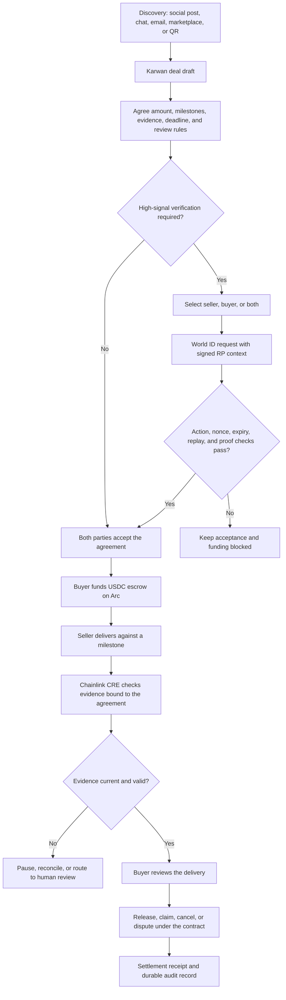

# Release notes

## ETHOnline 2026 build window: September 5 to September 9, 2026

This build window focused Karwan on one demonstrable trade loop: a buyer or
seller brings an agreement from any online channel, both parties review the
same terms, agents add evidence without taking payment authority away from the
people in the deal, and Arc records the settlement. The work was organized to
leave a repeatable product foundation that can support more providers, chains,
and trade types after the event.

The trust model now has two visible answers. Chainlink CRE helps establish what
happened by checking delivery evidence against the accepted agreement. World ID
and AgentKit help establish who is behind an automated action through signed
challenges, replay protection, and AgentBook lookup. Arc remains the settlement
record, and the user remains the decision maker for consequential money actions.

### Deal architecture flow

The ETHOnline build now connects the consumer entry point, identity signal,
delivery evidence, and settlement state in one bounded flow:

World ID supplies an optional participant signal, and CRE supplies a delivery
evidence boundary. Neither system moves funds. Arc escrow and the buyer's
reviewed decision remain authoritative for settlement.

### Consumer trade entry and agreement integrity

- Expanded the product story from a freelancer marketplace to an open market
  for goods, services, invoices, and purchase orders sourced from social posts,
  chat, links, and QR requests.
- Preserved source context as part of the trade intent and the immutable agreed
  terms digest, so a deal can move into Karwan without losing where it started.
- Hardened invite claiming, counterparty privacy, accepted terms versions, and
  delivery binding so an old or forwarded link cannot silently fund a different
  agreement.
- Kept the human approval boundary explicit: agents can research, score, and
  explain a trade, while a person still accepts terms, funds escrow, and
  approves release.

### Consumer account and mobile experience

- Reworked the public landing and authenticated account surfaces around the
  Trade Anywhere flow, with clearer actions for bringing in a trade, finding a
  counterparty, reviewing trust, and protecting payment.
- Consolidated account money actions into a single movement surface with
  readable direction, rail status, history, and receipt states.
- Added a shareable third-party deposit request path with a public review page,
  prefilled amount and recipient, expiry handling, QR support, and safe request
  cancellation.
- Improved mobile navigation, account guidance, profile and reputation views,
  deal detail, activity, settings, stake, bridge, and support surfaces while
  preserving the existing Karwan identity and multilingual message parity.
- Kept product copy provider-neutral where a banking or fiat corridor still
  needs its final operational configuration.

### Money movement and settlement foundations

- Added durable, idempotent money-rail intents for Gateway deposits, CCTP
  deposits, Arc transfers, bank deposits, card onramps, withdrawals, and
  offramps.
- Added request matching, provider-event verification, retry-safe recovery,
  cancellation, refund states, and Karwan reference binding for settlement
  records.
- Preserved the existing Arc USDC settlement path and made the new request
  layer additive, so a third party can fund a recipient without exposing wallet
  implementation details in the product flow.

### World identity and agent continuity

- Pinned `@worldcoin/idkit-core` and added server-side World ID RP signing,
  strict action, environment, nonce, and nullifier checks, and raw Developer
  Portal verification.
- Added durable nullifier storage and replay protection through the
  `world_id_nullifiers_v1` migration.
- Added `/api/world-id/status`, `/rp-signature`, and `/verify` routes with
  fail-closed configuration behavior and no payment authority attached to a
  proof.
- Added a staging-only Sandbox runner that creates a World simulator connector,
  polls for the result, and submits it to Karwan with an explicit execution
  mode.
- Kept AgentBook registration and resolution as a separate, inspectable path so
  the submission can show how multiple agents remain attached to one human
  allowance without inventing an identity result. The local integration now
  reaches the World AgentBook provider and safely rejects an unregistered agent;
  live registration remains pending the supported World verification path.

### High-signal deal verification

- Added an optional high-signal verification policy to direct deals. The buyer
  can require verification from the seller, the buyer, or both parties before
  acceptance and funding continue.
- Added party-scoped status, request, and verification routes. Requests carry a
  signed RP context, action, nonce, environment, and expiry; verification binds
  the returned proof to those values before changing deal state.
- Added nonce replay protection and nullifier replay protection. Karwan stores a
  SHA-256 proof reference rather than a raw nullifier or biometric data.
- Bound the selected verification policy and subject to the agreement digest, so
  changing the requirement creates a new agreement state instead of silently
  reusing an earlier acceptance.
- Added durable `deal.high-signal.requested`, `deal.high-signal.verified`, and
  `deal.high-signal.rejected` events. Event payloads record the role, subject,
  provider, environment, and result code without exposing proof material.
- Added a deal-page World ID flow using the official IDKit request widget. The
  check is a trust signal for higher-risk deals; it does not authorize payment,
  release, or dispute outcomes. Live completion still depends on World
  credential access in the target environment.
- Added focused tests for selected-party requirements, both-party requirements,
  unavailable credentials, rejected proofs, digest changes, and replay safety.

### Chainlink CRE delivery evidence

- Added the CRE Upgrade evidence path for GitHub delivery checks bound to an
  immutable pull-request SHA, accepted terms version, evidence revision, and
  allowlisted check producer.
- Added `VerifyEvidenceReceipt.s.sol`, a read-only Foundry assertion that checks
  the deployed receiver's exact receipt fields, recording time, and consumed
  report replay key.
- Added a strict Upgrade configuration example with confidential HTTP mode,
  Arc Testnet chain identity, secret references, receiver address, gas limit,
  and `writeReport: true`.
- Documented the required order for receiver deployment, workflow hashing,
  one-time workflow binding, production execution, and receipt verification so
  the evidence remains reproducible at the submitted revision.

### Reliability, security, and verification

- Fenced delivery and research workers with lease and attempt identities so an
  expired worker cannot publish a stale result or cancel a newer request.
- Reconciled legacy delivery requests through the durable queue before claims
  and invalidated evidence on redelivery.
- Added focused tests for World proof parsing, nullifier replay, CRE delivery
  integrity, report replay protection, and receiver receipt assertions.
- Maintained deterministic CRE fixture tests and Foundry contract tests so
  local verification stays separate from testnet execution.
- Kept the public evidence model source-agnostic: GitHub is the first concrete
  adapter, while carrier events, signed files, buyer acceptance, and other
  agreement-bound sources can use the same release gates.
- Updated the submission evidence pack with the demo sequence, negative-case
  matrix, reuse and AI disclosure, daily execution ledger, and the artifacts to
  capture for World, Chainlink, and Arc.

### Submission closeout

The final closeout will use dedicated test identities, a controlled GitHub
repository, Arc Testnet USDC, and a frozen candidate revision. The same deal
will carry the accepted terms, agent research result, private delivery verdict,
receiver receipt, funding receipt, release receipt, and recovery traces. The
release notes and evidence pack will be updated with observed identifiers and
transaction data as each runtime check completes, keeping the submission
auditable and ready for a larger production rollout.

### Remaining release gates

- Real bank and card providers, FX, compliance, refunds, and corridor
  reconciliation still require provisioned provider integrations.
- Direct one-transaction CCTP settlement into custom Karwan escrow still
  requires a verified receiver hook in the deployed contract.

### Verification

- Frontend tests: 268 passing.
- Backend tests: 946 passing, 32 intentionally skipped.
- Frontend production build: 66 pages generated.
- Frontend typecheck, shell route check, localization parity, and diff checks
  passed.
- The backend typecheck still reports the existing
  `src/scripts/world-id-sandbox.ts` spread-types issue.

## July 27, 2026

### Invoice factoring is opt-in

Factoring used to be opt-out. Every accepted trade-finance deal appeared in the
financier marketplace automatically, which published a supplier's counterparty,
amount and timing to every approved financier on the strength of them having
opened a deal. Nobody asked to be funded; the invoice was simply listed.

A supplier now requests early payout, optionally naming a floor they will
consider. Only then can financiers see the invoice and bid, and the supplier
accepts one or ignores them all. Withdrawing the request pulls the invoice back
off the desk without force-rejecting offers already made, so a financier who
priced one still gets an explicit answer.

Consent is enforced at the write path as well as the listing, so a financier
holding a jobId from an earlier session cannot put an offer in front of someone
who never asked or has since withdrawn. Bids under a stated floor are refused
where they are made rather than shown to the supplier.

### Purchase-order collateral is graded by reputation

How much collateral a supplier posts against a PO advance now comes from their
reputation tier rather than the financier guessing: 0% at elite, rising to 20%
for a new wallet, with a 25% floor on anything above 5,000 USDC regardless of
tier. Reputation grades the small deals, size governs the large ones.

It is a suggestion, not a gate. The financier sees it prefilled and can ask for
more; the desk stops them going under. Every figure is env-tunable so the ladder
can be re-rated without a deploy, and a malformed value falls back to the default
rather than parsing to zero.

### Purchase-order financing rebuilt around an atomic advance

A defect in the PO rail was found, reproduced, and fixed. The old design assigned
the deal's receivable to the financier at `fund()` while holding the advance in
the contract's own custody, released to the supplier only once proof of delivery
was anchored on the registry. Nothing in the ordinary milestone settlement path
anchors proof of delivery. So on the default path the escrow paid the financier
out of the supplier's proceeds while the supplier's advance stayed locked, and
after the release window the financier could reclaim the principal as well,
finishing a full repay amount ahead with nothing at risk.

The rail no longer has custody at all. `fund()` moves the advance from the
financier directly to the supplier, in the same transaction that assigns the
receivable, so no state exists in which the redirect is live and the advance is
unpaid. `releaseToSeller` and `reclaimPrincipal` are gone, along with the two
states that went with them.

Two further guards came out of testing the new design adversarially. A financier
who was already paid in full by the escrow can no longer let the repayment window
lapse and slash the supplier's collateral on top. And a default now recovers only
the amount the settlement failed to cover, returning the rest of the bond to the
supplier's free stake, instead of taking the whole bond for any shortfall.

Collateral requirements are derived from the supplier's reputation tier off
chain, with an owner-settable floor enforced on chain. Keeping tier policy out of
the contract means it can change without redeploying a money contract or
cascading through everything that references reputation.

- `contracts/test/KarwanPOCustodyAttack.t.sol` proved the exploit against the
  deployed contract first, then was flipped to prove it closed. It settles deals
  *without* anchoring proof of delivery, which is what the previous suite never
  did: every existing PO test ran through a helper that set it true, which is how
  a funds-losing rail sat behind a green suite.
- 423 tests passing across 36 suites, invariant gates included.
- `KarwanPOFinancing` is 7,180 bytes, down from 7,441 despite the additions:
  removing custody paid for them. The escrow is unchanged.

## July 6 to July 26, 2026

The contract bundle that the previous window described as in development is
deployed and serving. The headline is receivable assignment, which moves payment
risk out of the product and into the escrow: a financier who advances against a
deal is now paid by the contract, ahead of the seller, and the seller cannot
divert the settlement.

251 commits across the backend, contracts, and frontend.

### The contract bundle shipped

- Deployed and wired on Arc Testnet. Guardians are set on all four money-holding
  contracts, the arbiter is set, and the deployer address on the vault is zeroed.
  The current addresses are in the [README](./README.md#contracts-on-arc-testnet-chain-5042002).
- `assignPayout` records an irrevocable, single-use redirect on the escrow, and
  all four payout paths pay the assignee ahead of the seller. The assignee is
  senior across milestones and is capped at what is due rather than reverting.
  Refund paths are untouched, so a refund still returns the buyer's money.
- Arbiter resolution splits unreleased funds by basis points instead of picking a
  winner, and settles the seller's reserved stake in proportion to fault. A dead
  arbiter key can delay a deal but never trap it.
- The guardian, the on-chain deal clocks, the capped seller-appeal extension, the
  match window, and anti-farming reputation weighted by distinct settled
  counterparties all went live with the same bundle.
- 409 tests passing across 35 suites. The escrow sits at 23,885 bytes of the
  24,576 limit, so the remaining headroom is 691 bytes.

### Trade finance moved onto the assignment rail

- `KarwanInvoiceRegistry.assignReceivable` relays the financier's signed EIP-3009
  advance to the seller and assigns the receivable in one atomic, seller-gated,
  non-custodial call. Atomic because assignment is irrevocable: a seller who could
  assign before collecting could be griefed into redirecting a receivable to
  someone who never paid.
- Purchase-order financing assigns at `fund()`, in the same transaction as the
  advance, and reverts if it is not an authorised assigner.
- The factoring watcher now pulls only a shortfall. It would otherwise have
  charged every seller twice.

### Security

- Closed an unauthenticated auction dump and projected `GET /api/profile` so a
  non-owner no longer reads another user's personal fields.
- Bound the X OAuth callback to the session and closed an open redirect.
- Passkey registration now requires a proven email.
- Tightened the CORS origin check.

### Custody and terms

- Terms rewritten to version 2 across all five locales, with a new section on how
  an account is held. The previous claim that Karwan never holds the keys that
  move funds was not true of email and passkey accounts, and has been replaced by
  a plain description of what signing authority Karwan has and what bounds it.
- The README carries the same disclosure under Custody.

### Assistant and product

- The assistant bridges end to end inside the chat, with a source picker and
  in-panel signing. It requires sign-in and enforces per-account daily and weekly
  caps.
- The activity ledger collapses retry runs into a single row with a count, caps
  the visible list, and moves the network counters to the top of the page so they
  no longer read as a summary of the money list below them.
- Event labels now derive a readable phrase for every event type rather than
  printing a raw machine name.
- Watcher heartbeats read the same interval overrides as the watchers themselves,
  and report a starting state before the first tick, so a healthy watcher no
  longer reports as stalled.

## June 15 to July 5, 2026

This window moved Karwan from a working escrow marketplace to an agent-run
settlement network. Agents now research a deal before they price it, pay for
that intelligence per call in USDC, and negotiate against a shared market read.
A security agent screens every match and every delivery. We rebuilt the
cross-chain money path on CCTP V2, and the business finance rail (invoice
factoring, purchase-order financing) came together behind a launch flag.

242 commits across the backend, contracts, and frontend. What follows is grouped
by area rather than by date.

### Agent negotiation and matching

- Rebuilt the negotiation lifecycle to mirror how people actually trade. Sellers
  a buyer has closed clean deals with are evaluated first, the market is polled
  concurrently instead of one seller at a time, and the auction window stays open
  while agents are still deciding rather than closing on a fixed timer. A stronger
  bid that arrives late gets one counter at the buyer's cap, with the agreed match
  held in reserve as the fallback.
- Ranking leads with skill and topical fit. Reputation only breaks ties between
  comparable matches, so a strong specialist is never buried under a
  higher-reputation generalist.
- Relationship memory. A buyer agent remembers proven sellers and gives them a
  small, capped edge in ranking and negotiation. It never beats a clearly better
  or cheaper newcomer, and it never pays above the buyer's cap.
- Proceed-or-pass on a near miss. When the best achievable price lands just
  outside the buyer's range, the agent surfaces it with the market reason attached
  and waits for a human decision, instead of declining behind the buyer's back. It
  always surfaces the best seller it found, not a weaker, pricier fallback.
- An honest stop when nothing fits the budget. If the only match is priced far
  past budget and nothing cheaper exists, the deal says so plainly and offers one
  tap to raise the budget or bring back an offer the buyer passed.
- Structured-output negotiation model. Bid scoring, counter evaluation, and the
  market read run on a model tuned for strict schema output, so a malformed
  response never stalls a live negotiation. The deterministic ranking stays the
  source of truth; the model writes the reasoning, not the decision.
- Buyers can set a custom milestone split on a request, carried into escrow when
  the agent finds a deal. Milestones support two to five tranches.

### Paid market intelligence over x402

- Agents pay for a live market read before negotiating, funded per call in USDC.
  The read is a shared good: once one side researches an order, both agents
  negotiate against the same grounded price rather than guessing. The research
  credit is charged only to the buyer and seller who actually match.
- Two rails, both real. Internal signals (credit passport, repayment behaviour,
  counterparty concentration) are sold over x402 and settled through Circle
  Gateway Nanopayments on Arc, with gasless EIP-3009 authorizations batched
  onchain. External research runs on the standard x402 exact-EVM scheme on Base,
  where the agent pays a web-search provider and synthesises a market read.
- A deal-aware security agent fronts the single external research call the moment
  an order is posted and writes the result into a shared cache, so no agent bids
  blind and no one pays twice. It is neutral by design: the read is a shared good,
  not an edge one side bought.
- Every payment emits an `agent.paid` event, so the nanopayment trail is auditable
  per deal. `GET /api/x402` lists the internal paid endpoints and their prices.

### Delivery and counterparty safety

- A security agent scans every delivery proof before the buyer sees it, and the
  same scan guards in-app chat so a phishing or malware link cannot reach a
  counterparty in the first place.
- A flagged link pauses the deal's automatic release and routes both sides to
  resolve it together in chat. A confirmed bad link is a heavy hit to the sender's
  reputation. File deliveries move through a link the agent can check, not an
  unverified attachment.
- The security agent screens a match before it is proposed. New and low-reputation
  counterparties route to human review rather than an automatic decline.

### Settlement and cross-chain money movement

- Rebuilt the bridge on CCTP V2. USDC moves into Arc from Base, Ethereum,
  Arbitrum, Optimism, and Polygon testnets, plus Solana Devnet. The backend relays
  the destination mint, so a user never holds an Arc gas asset to get started.
- Cash out to a chosen chain and recipient after settlement. Arc-to-Arc transfers
  are instant; cross-chain cash-out routes through CCTP V2 with an inline progress
  card.
- Durable, resumable bridge state. A transfer that is interrupted resumes from its
  last attested step, and a mint that lands without a returned hash still settles
  to done rather than reading as failed.
- Circle Gateway gives a business one pooled USDC balance across twelve chains.
  Deposit once, then spend to any chain from a single signature, with no chain
  switching and no source-chain gas.
- Withdrawal to every CCTP chain through Circle's Forwarding Service, which submits
  the destination mint, so a user cashes out anywhere without holding that chain's
  gas token.

### Staking, insurance, and treasury yield

- A staker locks USDC into the vault, and the same principal does two jobs. When a
  seller accepts a deal, the escrow reserves part of their free stake against it; a
  lost dispute slashes that reservation to the buyer. Trusted Match mode makes the
  reservation a precondition for matching.
- Platform-fee reserves route through Hashnote USYC on Arc Testnet via an
  ERC-4626 treasury that subscribes idle USDC into USYC and redeems on demand. The
  treasury holds real, allowlisted USYC, verifiable with `npm run usyc:prove`.

### SME trade finance

- Financier desk. A self-serve surface for financiers to fund invoices and
  purchase orders, gated behind the SME Trades launch flag while it runs through
  pilot.
- Invoice factoring. A financier pays a seller early at a discount tied to the
  seller's reputation tier; on settlement the escrow routes funds to the financier.
  Hardened with idempotency keys and unique money indexes so a retry cannot
  double-fund.
- Purchase-order financing. Working capital advanced against an accepted purchase
  order, paid to the supplier in the same transaction that redirects the deal's
  settlement to the financier.
- Credit passport. A portable onchain record of completed deals, repayment
  behaviour, and counterparty concentration that travels with each business.

### Platform, reliability, and product

- Security sweep across the backend: signed sessions required on every write, rate
  limits, session hardening, security headers, and user and auth state moved to
  Postgres. Containers run as a non-root user.
- The landing page reads real onchain statistics rather than static copy.
- Event handling made resilient. The agent poller reads events over HTTP instead
  of a dropping WebSocket, and a reconciler self-heals any `JobPosted` event a
  seller agent missed.
- Database egress cut with short-lived caches on hot read loops, after a
  full-table read pattern drove a provider egress spike.
- New-user onboarding funds a buyer and seller agent with a working USDC float on
  activation, so a first-time user lands ready to trade.
- Localised across five languages. Per-page guide tours cover the key elements of
  each screen. A privacy pass tightened who can read a matched deal.

### In development, targeting the next contract release

Superseded. Everything below shipped in the July 6 to July 26 window above, in one
immutable bundle rather than a mid-cycle redeploy.

- A contract-level guardian that places bounded, auto-expiring holds and records
  delivery attestation across the escrow, vault, treasury, and financing
  contracts. It can pause a settlement but never move funds.
- Arbiter dispute resolution with proportional splits, a seller claim path after a
  review window, consented agent binding, and vault solvency enforcement.
- Deal-timing at the contract level: consented per-deal clocks, a capped
  seller-appeal extension flow, and an on-chain match window.
- Anti-farming reputation that weights standing by distinct settled counterparties,
  so volume against a single repeat party cannot inflate a score.
- Full test suite including adversarial exploit cases, run under an internal audit
  cycle with findings tracked to resolution.

### How to verify

- Live on Arc Testnet at [karwan.site](https://karwan.site).
- `GET /api/x402` lists the internal paid endpoints and prices.
- `agent.paid` events expose every nanopayment, internal and external, per deal.
- `npm run usyc:prove` reports the treasury's real USYC holding and reconciles it
  against the onchain oracle.

### Stack

Arc Testnet (USDC as native gas), Circle Developer-Controlled Wallets, Circle
Gateway Nanopayments and CCTP V2, x402 (Circle Gateway on Arc, exact-EVM on Base),
Hashnote USYC, ERC-8004 reputation, viem, Foundry, Hono, Next.js.
