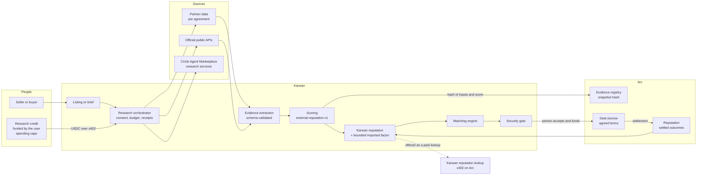

# Agent lanes: trust you can carry into a deal

Karwan's escrow makes the payment side of an online deal safe: money sits in a contract on Arc and is released on terms both sides agreed. The agent lanes address the other side of trust: **who is this person, and who else should I be trading with?**

Karwan's agents gather evidence about a counterparty, score it with a published mathematical model, and bring buyers and sellers together. The evidence comes from inside Karwan and, with permission, from the places people have already built a track record. Karwan is not a replacement for freelance marketplaces, review sites or other escrow services. It is designed to work alongside them.

Each part below is marked **Live on testnet**, **Built, off by default** or **Planned**.

## Principles

1. **Math decides, the model reads.** Scores and rankings come from deterministic, versioned formulas. A language model may extract fields, understand what a person is asking for and explain a result. It never chooses a weight or a final number.
2. **Evidence has provenance.** Every score shows its sources, how each was verified and when. History earned on Karwan and history imported from elsewhere are always shown separately.
3. **Only data Karwan may use.** No scraping, no automation that breaks another platform's terms, and no resale of another platform's data without its agreement. Partner data is used at the moment of a deal and not kept beyond the partner's limits.
4. **People decide on money.** Agents find, score and suggest. A person accepts the match and a person funds the deal. The contract enforces the terms.
5. **Every paid call leaves a receipt** the user can see: what was bought, from whom, for how much, and what it concluded.

## Lane 1: matching inside Karwan

**Live on testnet.** A buyer posts a brief and a seller lists an offer. Agents on both sides:
- filter candidates on hard rules (lane, budget, deadline, verification, stake, self-dealing);
- rank them with deterministic scoring;
- negotiate inside the price range each person set;
- pass the result through a security gate before anyone is asked to fund.

Reputation is Karwan's own composite model, built from settled deals, stake and tenure (see [reputation model](./reputation-model.md)). The runtime behind this is described in [agent workflows](./agent-workflows.md).

## Lane 2: evidence and discovery beyond Karwan

**Planned.** Two jobs:

- **Bring your reputation.** When listing an offer or posting a brief, a person can point Karwan at the places they already have a track record. Agents collect that evidence through permitted channels and score it with the model below. The score is attached to the listing with its sources.
- **Find counterparties beyond Karwan.** If the person opts in, agents look outside Karwan for likely buyers or sellers, using paid research services from Circle's Agent Marketplace. Agents surface leads with the evidence behind them and prepare a Karwan deal link; the person decides whether to send it. Agents do not contact people on anyone's behalf.

### Where evidence may come from

| Tier | Source | Examples | Status |
|---|---|---|---|
| Core | Karwan's own settled-deal history on Arc | Escrow outcomes, stake, disputes | Live on testnet |
| A | Platform data under written agreement, paid per lookup, not stored | Freelance marketplaces and review services | Planned; each needs an agreement |
| B | Official public APIs that allow this use, linked to the person's own account | Developer and community platforms, marketplace feedback | Planned |
| C | Proofs a person generates of their own account data | Web-proof protocols | Under evaluation, pending legal review |

## Architecture

### How it stays in step with the contracts

| Moment | What happens | On Arc |
|---|---|---|
| Listing scored | The evidence set is scored with a named model version | A hash of the inputs, model version and score is anchored |
| Deal funded | The terms reference the evidence snapshots each side relied on | The escrow stores the agreement hash |
| Delivery | A deterministic check plan built from the terms ([escrow design](./escrow-design.md)) | The check result is attested against the delivery |
| Settled or disputed | The outcome feeds Karwan reputation | The reputation contract records a value-weighted outcome |

Imported evidence helps a newcomer start. It fades as the person settles deals on Karwan, so earned history ends up dominating. Evidence that turns out to be misrepresented is grounds for a dispute.

## The scoring model: `external-reputation-v1`

**Built, not yet connected** (`backend/src/reputation/external.ts`, with tests). For each source:

1. **Weight each outcome:**
   - by age, with a one-year half-life: `2^(−age / 365 days)`;
   - by deal value, on a concave curve: `log2(1 + value / 100 USD)`, so large deals count more but not proportionally more;
   - count each counterparty at most three times, so one repeat client cannot build a record alone.
2. **Take the Wilson lower bound** (z = 1.96) of the weighted success rate. A short record cannot outrank a long one with the same rate.
3. **Weight by how the evidence was verified:**

   | Verification | Weight |
   |---|---|
   | Partner-attested | 1.0 |
   | Official API linked to the person's account | 0.8 |
   | Person-generated proof | 0.6 |
   | Self-reported | 0 |

Sources are combined in proportion to their verified evidence, then shrunk toward a neutral prior (20 pseudo-outcomes at 0.5).

With no verifiable evidence, there is no score. It is not reported as "average".

Inside Karwan's composite, imported evidence is a bounded factor with a weight of `0.15 × e^(−settled Karwan deals / 10)`.

| Record | Score |
|---|---|
| 3 successful engagements | 0.52 |
| 20 engagements at 95% | 0.69 |
| 120 at 98% | 0.91 |
| 120 at 70% | 0.62 |

## Economics

| Flow | Paid by | Earned by | Rail |
|---|---|---|---|
| Internal search and scoring | The person's research credit | Karwan, per call | x402, Circle Gateway nanopayments on Arc |
| External research services | The person's research credit | Marketplace service providers | Circle Agent Marketplace |
| Partner reputation lookup | The person's research credit | The partner platform, per lookup | x402 or the partner's MCP server, per agreement |
| Karwan reputation lookup | Other platforms' agents | Karwan | x402 on Arc |
| Escrow | Deal parties | Karwan's escrow fee | Deal escrow on Arc |

Karwan already sells deal-history signals over x402 on testnet (credit passport, repayment behaviour) and already buys research over x402. The Agent Marketplace catalogue does not yet include a counterparty reputation service.

## Safeguards

- Human approval on accepting a match and on funding a deal, which keeps consequential decisions with people.
- Scores come with their evidence, and a person can contest them.
- Karwan is a party to the deals it scores, so its reputation is never presented as independent reviews.
- Only escrow-settled outcomes count towards Karwan history. Each counterparty's weight is capped, and larger deals need stake.
- An unreadable or failed source is shown as skipped, never guessed.

## Milestones

Partner milestones depend on agreements and are targets, not commitments.

| Target | Milestone |
|---|---|
| Sep 2026 | This architecture published. The scoring model implemented and tested. |
| Oct 2026 | Paid research switched on in the testnet agent runtime, with receipts and spending caps. Karwan reputation lookup exposed as an x402 endpoint. Contract suite staged on Arc mainnet. First official-API evidence connectors on testnet. |
| Nov 2026 | Karwan reputation lookup on Arc mainnet. Discovery beyond Karwan. "Strengthen your listing" in the product. |
| Q1 2027 | First partner platform integration, subject to agreement. A decision on person-generated proofs after legal review. |
