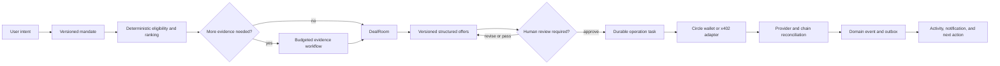

# Agent workflows

This document is the public map of Karwan's reliable agent runtime. The runtime
is implemented in the repository and deployed through independent, default-off
rollout flags. Until a gate is enabled and its rollout report passes, the
existing buyer, seller, and settlement paths remain authoritative.

## What the runtime guarantees

- User intent is captured in versioned mandates. An agent cannot widen a price,
  deadline, evidence, staking, or spending boundary by itself.
- Eligibility and ranking are deterministic. Model output can explain or
  evaluate within a bounded schema, but it cannot override a hard policy gate.
- Every durable action has an idempotency key, a lease, bounded retries, and
  checkpoints. A restart resumes work instead of starting it again.
- External payment and wallet results can be uncertain. `UNKNOWN` and
  `RECONCILING` are durable states, never aliases for success or permission to
  submit the same transaction again.
- Financial execution begins only after an explicit approval or a
  contract-defined automatic outcome. The policy decision is recorded before
  the provider call.
- Events are stored before delivery. Browser projections and notifications can
  replay from a cursor without inventing or reordering deal history.

## End-to-end flow

The same state machine covers person-to-person and business trade. Business
verification, account type, lane, stake, and evidence rules change eligibility,
not the reliability model.

## Workflow map

| Workflow | What the agent does | Authority boundary | Durable record |
| --- | --- | --- | --- |
| Candidate matching | Builds normalized profile and listing projections, applies lane, budget, deadline, self-dealing, verification, stake, and reliability filters, then ranks eligible candidates by fit. | A semantic evaluator may add bounded evidence. It cannot admit a candidate rejected by a hard filter. | Match audit, proposal revision, evidence references, and review coverage. |
| Qualification | Checks verified capabilities, completed trade evidence, research freshness, and stake sufficiency. | Missing, stale, contradictory, or unpaid evidence blocks qualification or requests review. It never counts as verified. | Evidence need, snapshot, blocker, and qualification checkpoint. |
| Negotiation | Creates immutable, versioned offers inside the buyer and seller mandates. It can counter, surface a near miss, pause at an impasse, or schedule one bounded re-engagement after a material change. | Acceptance checks the latest mandate and DealRoom version. Stale, superseded, expired, or withdrawn offers cannot be accepted. | DealRoom, mandate snapshots, offer revisions, command ledger, and attempt history. |
| Paid evidence | Reuses fresh evidence first. When a purchase is justified, it discovers an eligible service, enforces provider, network, asset, recipient, price, provenance, and per-deal budget policy, then pays over x402. | Circle Marketplace discovery identifies purchasable API services only. It never identifies or verifies a Karwan person or SME. | Research credit, purchase lifecycle, provider receipt, response hash, provenance, and reconciliation state. |
| Stake qualification | Calculates the shortfall before negotiation, requests approval when required, waits for funding, submits once, and resumes from the confirmed funding receipt. | No stake is approved or moved without an unexpired approval. A closed deal cannot consume an old approval. | Approval claim, qualification blocker, funding receipt, financial command, and stake checkpoint. |
| Financial execution | Records an authorized transfer or contract call, submits it through the Circle wallet boundary once, then reconciles provider and chain finality. | A provider ID or transaction hash is correlation data, not proof of settlement. Unknown outcomes are reconciled, not resent. | Financial command, MoneyMovement reference, provider lifecycle, receipt, and reconciliation checkpoint. |
| Delivery and recovery | Publishes ordered domain events, updates browser projections, and sends notifications. Failed work retries with leases and bounded backoff, then moves to a dead letter. | Admin replay is authenticated and idempotent. Only explicitly replayable shadow tasks can be replayed manually. | Domain event, outbox delivery, replay cursor, task audit, and dead letter. |

## Circle Agent Stack in the workflow

Karwan uses all five Circle Agent Stack surfaces, split between the application
runtime and operator tooling so one credential never owns every capability.

| Agent Stack surface | Karwan use |
| --- | --- |
| [Circle CLI](https://developers.circle.com/agent-stack/circle-cli) | Operator interface for Agent Wallet login, wallet policy inspection, CCTP and Gateway smoke checks, service discovery, paid-service tests, and Circle Skill management. It is an operator tool, not a subprocess called by the public API. |
| [Agent Wallets](https://developers.circle.com/agent-stack/agent-wallets) | Isolated, user-custody wallets for operator-controlled agent research and Agent Marketplace payments. Spending limits and recipient or contract policies bound that wallet. Customer deal automation continues to use Karwan's existing Developer-Controlled Wallet SCAs, so operator research access cannot move customer deal funds. |
| [Agent Nanopayments](https://developers.circle.com/agent-stack/agent-nanopayments) | Gas-free, batched USDC payments for Gateway-compatible reads, implemented with `@circle-fin/x402-batching`. The reviewed evidence record identifies when a provider instead requires the standard exact-EVM rail. |
| [Agent Marketplace](https://developers.circle.com/agent-stack/agent-marketplace) | The public [Discovery API](https://developers.circle.com/agent-stack/agent-marketplace/discovery-api) is the source of truth for currently listed paid API services, payment rails, networks, prices, schemas, and provider metadata. It is not a people or SME directory. |
| [Circle Skills](https://developers.circle.com/ai/skills) | Installed development and operations knowledge for wallet policy, funding, CCTP bridging, nanopayment buyer and seller flows, and Circle integration review. Runtime policy still lives in versioned Karwan code and tests. |

The application also uses USDC on Arc, Developer-Controlled Wallets, App Kit,
CCTP V2, Gateway unified balance, Gateway Nanopayments, and Hashnote USYC. See
[Circle integration](./circle-integration.md) for the SDK and custody details.

## Marketplace evidence policy

Service discovery is followed by Karwan policy. Discovery alone never
authorizes spend.

1. Query the Discovery API with `siwx=false` for unattended workflows.
2. Validate the exact URL, method, input schema, output schema, price, asset,
   payment network, recipient, and Gateway support from the current listing.
3. Apply the mandate, evidence value, freshness, reliability, provenance,
   research-credit, and per-deal spend gates.
4. Prefer Exa for web research, with Serper as the economical fallback.
5. Use OpenMart and Voygr only as supplemental business evidence.
6. Use Allium only after separately confirming that the chain being
   investigated is supported. A supported payment network does not prove data
   coverage for that chain.
7. Persist authorization before signing, then persist the receipt and response
   hash. A timeout after signing remains `UNKNOWN` until reconciliation.

The complete provider boundary is in
[Circle Agent Marketplace service policy](./circle-agent-marketplace-services.md).

## Rollout controls

All flags below default to off. They are independent so one behavior can be
observed and rolled back without activating the rest.

| Flag | Scope |
| --- | --- |
| `AGENT_RUNTIME_V2_ENABLED` | Starts the Postgres-backed durable task runtime. Required by every V2 workflow. |
| `EVENT_OUTBOX_V2_ENABLED` | Delivers persisted events to notifications and browser projections. |
| `MATCH_ENGINE_V2_SHADOW` | Records matching and buyer-timer parity without replacing legacy authority. |
| `NEGOTIATION_V2_SHADOW` | Validates and checkpoints legacy-derived structured offers without publishing them. |
| `NEGOTIATION_V2_ENABLED` | Reserved cutover flag. It is parsed and default-off, but no legacy production route delegates authority to it yet. |
| `EVIDENCE_V2_SHADOW` | Records evidence needs, policy decisions, provider health, and qualification blockers without purchasing. |
| `EVIDENCE_RESEARCH_CREDIT_V2_ENABLED` | Authorizes the reviewed x402 adapter and the separate research-credit ledger. |
| `STAKING_V2_ENABLED` | Enables checkpoint-only stake qualification, blockers, and funding-resume observations. It does not approve or move funds by itself. |
| `FINANCIAL_COMMANDS_V2_ENABLED` | Enables checkpoint-only financial command and reconciliation shadows. It does not call Circle or move funds by itself. |
| `FINANCIAL_RECONCILIATION_V2_ENABLED` | Polls already submitted Circle operations. It never creates or retries a transfer. |
| `REVIEWED_OPERATION_TASKS_V2_ENABLED` | Connects the authenticated reviewed-operation ingress to negotiation, evidence, staking, and financial handlers. |

The admin runtime reports task state, parity, matching review coverage,
negotiation and evidence observations, research credit, financial uncertainty,
dead letters, and rollout eligibility under `/api/admin/agent-runtime`. Reviewed
operations are isolated under `/api/admin/reviewed-operation-ingress` and require
the admin authorization boundary.

## Production gate

Code presence is not the production gate. A V2 behavior is ready to replace its
legacy path only after its shadow sample, semantic review coverage, duplicate and
stale-command checks, unknown evidence count, financial uncertainty count,
dead-letter count, restart simulation, and failure-injection suite meet the
configured rollout thresholds. Flags are enabled one at a time and can be turned
off without losing the durable audit trail.
