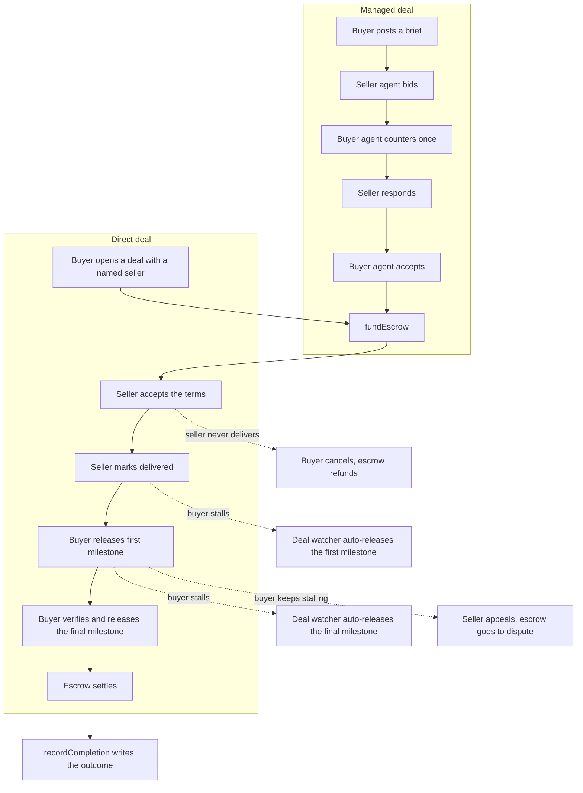

# Architecture

## Components

- **Frontend.** Next.js 15 dashboard. Users sign in three ways (passkey,
  email OTP, SIWE on a web3 wallet), open deals, release funds, watch the
  event feed over SSE, share deal links by email, and cash out cross-chain
  through an inline CCTP progress card.
- **Backend.** Hono API. Holds the buyer and seller agent loops with their
  asymmetric negotiation walk, the deal watcher that runs review-window
  timers and the auto-release ladder, the CCTP relay (both directions),
  the SSE event bus, the OTP and SIWE auth flow, and the cashout router.
- **Contracts.** `KarwanJobBoard`, `KarwanEscrow`, `KarwanReputation`, `KarwanVault`, `KarwanTreasury`, and `KarwanYieldDistributor` on Arc Testnet (chain 5042002), plus `KarwanInvoiceRegistry` and `KarwanPOFinancing` for the SME layer. USDC is the native gas asset. The treasury subscribes idle USDC into Hashnote USYC through an ERC-4626 Teller. Older contract generations stay registered so legacy positions remain reachable through `/legacy`. See the contract table in the [README](../README.md).
- **Circle stack.** USDC, Developer-Controlled Wallets, CCTP V2, Gas Station, Hashnote USYC, and x402 nanopayments. See [circle-integration.md](./circle-integration.md).
- **Storage.** Postgres (via Drizzle) for profile and direct-deal metadata,
  with a flat-file fallback that mirrors the same shape for fast cold
  starts. The chain is the source of truth for everything financial;
  Postgres holds off-chain bits like the terms text, the delivered flag,
  match proposals, the extension-request history, and the Telegram link
  table.

## The wallet model

A user's connected browser wallet identifies them. It does not sign Karwan's
business transactions. Two Circle Developer-Controlled Wallets do that: a buyer
agent and a seller agent, both Smart Contract Accounts on Arc. They sign
`postJob`, `submitBid`, `acceptBid`, `fundEscrow`, `releaseProgress`,
`recordCompletion`, the CCTP `receiveMessage` relay, and `dispute`.

The one transaction a user signs from their own wallet is the CCTP burn on the
source chain when they bridge USDC over to Arc.

The reason for this split: the negotiation and the review-window timers run
server-side and have to act when the user is not on the page. A browser
extension wallet cannot sign in the background. A Circle Developer-Controlled
Wallet can.

## The two deal flows

A managed deal walks the full path. A direct deal skips the auction and goes
straight to funding with a named seller.

## Escrow and the fee split

`KarwanEscrow` funds on a milestone schedule. A platform fee, 150 basis
points by default, splits evenly between buyer and seller. The buyer funds
the deal amount plus their half of the fee. The seller nets the deal amount
minus their half. The treasury collects the full fee proportionally as each
milestone releases. The final milestone sweeps any rounding remainder so
the escrow ends empty.

On accept, the escrow reserves `dealAmount × reservationBps` from the
seller's free stake in `KarwanVault`. The reservation releases back on a
clean settlement and slashes to the buyer on a failed dispute. The buyer
sets the reservation per deal on the accept panel; default is 30%. Trusted
Match mode raises the floor and refuses bids from sellers whose free stake
sits below the reservation requirement.

The dispute path is symmetric. Either side can settle a `Disputed` deal
through `releaseFromDispute`, so disputed deals are not a one-way trapdoor.

## Cashout

After settlement, the seller hits `/cashout/[jobId]`. The page exposes both
the seller's Circle identity wallet and the per-deal seller-agent wallet
where escrow paid out, and lets them pick the source.

Two cashout destinations:

- **Arc-to-Arc.** Direct USDC transfer to any wallet on Arc. Instant.
- **Cross-chain.** CCTP V2 burn on Arc, mint on Ethereum, Base, Arbitrum,
  Optimism, Polygon Sepolia, or Solana Devnet. The page polls bridge
  status every 4 seconds and shows burning, burned, attested, minted on
  an inline progress card. The user never has to track a tx hash on a
  block explorer.

The same backend pipeline that runs CCTP ingress runs cashout in reverse.
One `bridges` table tracks both directions.

## Shareable deal links

A buyer can open a direct deal pointed at an email address instead of a
wallet. Resend sends a branded invite with a one-time code. The recipient
lands on a stripped-down `/invite/[token]` page (no top nav, no marketing
chrome), types the OTP, and a Circle wallet provisions in the browser at
that moment. They accept the deal. Escrow funds.

`/invite` is opt-in to the full Karwan experience after claim. The
recipient can keep going on the bare deal surface, or click "Open full
Karwan" to enter the app.

## Review windows and auto-release

Two timers protect both sides from a stalling counterparty.

After the seller marks delivered, the buyer has a window to release the
first milestone. If they sit on it past the delay-appeal grace, the deal
watcher auto-releases the first tranche on their behalf. The final tranche
never auto-releases, only on the buyer's explicit click. This stops a
silent auto-release from settling a deal the buyer never verified.

The buyer can tip "still reviewing" to extend the first window, capped at
three extensions. If a buyer keeps stalling, the seller raises a
delay-appeal that gives the buyer a short window to respond; on silence,
the watcher releases the first tranche and the cycle continues.

The seller can also request a deadline extension as a structured
deal-state action. The buyer sees a banner with the proposed duration and
optional reason, then approves or declines. The whole exchange is
audit-logged on the deal record, not buried in chat.

If the seller never marks delivered and the deadline passes, the buyer
cancels. The escrow goes to `Disputed` and either party settles it through
`releaseFromDispute` (refund the buyer or release to the seller). The
reservation slashes to the buyer on a refund-out path.

## Reputation

When a deal settles, the agent calls `recordCompletion` on `KarwanReputation`.
A clean settlement records Success, a cancel records Failed, and an appeal
records DisputeResolved, against both parties so each side's record reflects
the outcome. The on-chain counts feed a composite score from 0 to 1000 that
the app renders as a tier, blending settled-deal history, stake, activity, and
account age. The score follows the wallet, not a Karwan account. The full
formula, tier breakpoints, and agent integration are in
[reputation-model.md](./reputation-model.md).

## SME Trades

The SME layer extends the same escrow primitive to business-to-business and
cross-border trade finance. It is built and gated behind a launch flag while
it runs through pilot, so the surfaces below stay off the P2P deal view until
the flag is set.

- **Trade context.** A deal can carry Incoterms, payment terms, counterparty
  company details, and document hashes anchored on `KarwanInvoiceRegistry`.
- **Invoice factoring.** A financier advances a seller a discounted payout
  against an accepted invoice, signed as a USDC EIP-3009 authorization at offer
  time. On settlement, a settlement watcher routes the repayment from seller to
  financier. The discount is gated by the seller's reputation tier.
- **Purchase-order financing.** `KarwanPOFinancing` holds a financier's
  advance against an accepted purchase order and releases it to the supplier
  when proof of delivery is anchored on the registry.
- **Credit passport.** The reputation surface gains an SME band with company
  details and a rolling repayment record, so a financier can underwrite a
  counterparty from one shareable page.
- **Paid agent signals.** Agents pay per call over Circle's x402 nanopayment
  surface for outside data during bid scoring: counterparty sanctions
  screening, the platform's own credit-passport reads, and market context.
  Settlement runs through Circle Gateway batching so a sub-cent call never pays
  a full transaction fee.
