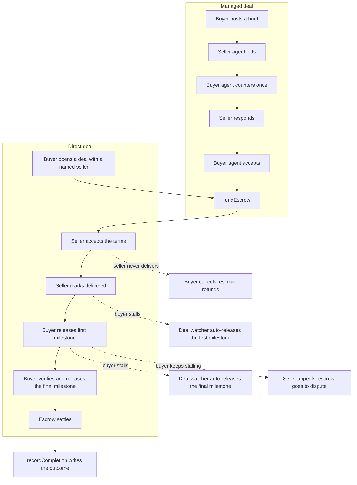

# Architecture

## Components

- **Frontend** — Next.js 15 dashboard. Buyers and sellers connect a wallet,
  open deals, release funds, and watch a live event feed over SSE.
- **Backend** — Hono API. It holds the agent loops (buyer agent, seller agent),
  the deal watcher that runs the review-window timers, the CCTP relay, and the
  SSE event bus.
- **Contracts** — `KarwanJobBoard`, `KarwanEscrow`, `KarwanReputation` on Arc
  Testnet (chain 5042002). USDC is the native gas asset.
- **Circle stack** — USDC, Developer-Controlled Wallets, CCTP V2. See
  [circle-integration.md](./circle-integration.md).
- **Storage** — Postgres (via Drizzle) for profile and direct-deal metadata.
  The chain is the source of truth for anything financial; Postgres holds the
  off-chain bits like terms text and the delivered flag.

## The wallet model

A user's connected browser wallet identifies them. It does not sign Karwan's
business transactions. Two Circle Developer-Controlled Wallets do that: a buyer
agent and a seller agent, both Smart Contract Accounts on Arc. They sign
`postJob`, `submitBid`, `acceptBid`, `fundEscrow`, `releaseProgress`,
`recordCompletion`, the CCTP `receiveMessage` relay, and `dispute`.

The one transaction a user signs from their own wallet is the CCTP burn on the
source chain when they bridge USDC over to Arc.

The reason for this split: the negotiation and the review-window timers run
server-side and have to act when the user is not on the page. A browser
extension wallet cannot sign in the background. A Circle Developer-Controlled
Wallet can.

## The two deal flows

A managed deal walks the full path. A direct deal skips the auction and goes
straight to funding with a named seller.

## Escrow and the fee split

`KarwanEscrow` is funded with a milestone schedule. A platform fee, 150 basis
points by default, is split evenly between buyer and seller. The buyer funds
the deal amount plus their half of the fee. The seller nets the deal amount
minus their half. The treasury collects the full fee, taken proportionally as
each milestone releases. The final milestone sweeps any rounding remainder so
the escrow ends empty.

## Review windows and auto-release

Two timers protect both sides from a stalling counterparty.

After the seller marks delivered, the buyer has a window to release the first
milestone. If they sit on it, the deal watcher releases it for them and opens
the second window. After the first milestone is out, the buyer has another
window to verify and release the final milestone. Buyer silence past the window
counts as acceptance, and the watcher releases the rest.

The buyer can tip "still reviewing" to add time to the final window, capped at
three extensions. If a buyer keeps stalling, the seller can appeal once the base
window has passed, which moves the escrow to a disputed state on chain.

If the seller never marks delivered and the deadline passes, the buyer can
cancel. The escrow moves to disputed, then refunds the buyer in full, and the
reputation registry records a failure against the seller.

## Reputation

When a deal settles, the buyer agent calls `recordCompletion` on
`KarwanReputation` with a Success outcome against the seller. A cancel records
Failed. An appeal records DisputeResolved. `getReputationScore` returns a score
in basis points that the frontend renders as a tier. The score follows the
wallet, not a Karwan account.
