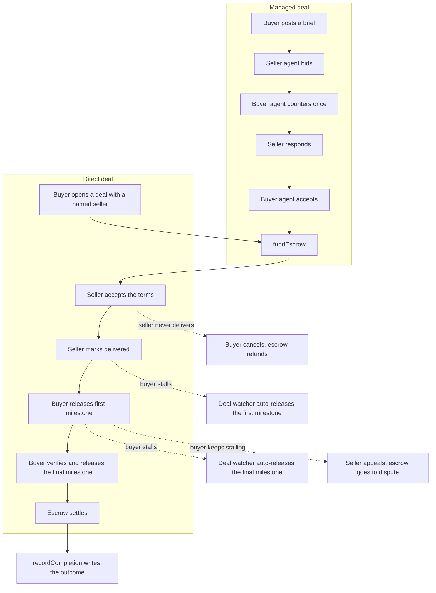

# Architecture

## Components

- **Frontend.** Next.js 15 dashboard. Users sign in three ways (passkey,
  email OTP, SIWE on a web3 wallet), open deals, release funds, watch the
  event feed over SSE, share deal links by email, and cash out cross-chain
  through an inline CCTP progress card.
- **Backend.** Hono API. Holds the buyer and seller agent loops with their
  asymmetric negotiation walk, the deal watcher that runs review-window
  timers and the auto-release ladder, the SecurityAgent that scans delivery
  proofs and chat links, the CCTP relay (both directions), the SSE event bus,
  the OTP and SIWE auth flow, and the cashout router. The agent loops watch
  chain events by polling the RPC over HTTP, so a dropped websocket never
  silently stops them.
- **Contracts.** `KarwanJobBoard`, `KarwanEscrow`, `KarwanReputation`, `KarwanVault`, `KarwanTreasury`, and `KarwanYieldDistributor` on Arc Testnet (chain 5042002), plus `KarwanInvoiceRegistry` and `KarwanPOFinancing` for the SME layer. USDC is the native gas asset. The treasury subscribes idle USDC into Hashnote USYC through an ERC-4626 Teller. Older contract generations stay registered so legacy positions remain reachable through `/legacy`. See the contract table in the [README](../README.md).
- **Circle stack.** USDC, Developer-Controlled Wallets, CCTP V2, Gas Station, Hashnote USYC, and x402 nanopayments. See [circle-integration.md](./circle-integration.md).
- **Storage.** Postgres (via Drizzle) for profile and direct-deal metadata,
  with a flat-file fallback that mirrors the same shape for fast cold
  starts. The chain is the source of truth for everything financial;
  Postgres holds off-chain bits like the terms text, the delivered flag,
  match proposals, the extension-request history, and the Telegram link
  table.

## The wallet model

A user's connected browser wallet identifies them. It does not sign Karwan's
business transactions. Two Circle Developer-Controlled Wallets do that: a buyer
agent and a seller agent, both Smart Contract Accounts on Arc. They sign
`postJob`, `submitBid`, `acceptBid`, `fundEscrow`, `releaseProgress`,
`recordCompletion`, the CCTP `receiveMessage` relay, and `dispute`.

The one transaction a user signs from their own wallet is the CCTP burn on the
source chain when they bridge USDC over to Arc.

The reason for this split: the negotiation and the review-window timers run
server-side and have to act when the user is not on the page. A browser
extension wallet cannot sign in the background. A Circle Developer-Controlled
Wallet can.

## The two deal flows

A managed deal walks the full path. A direct deal skips the auction and goes
straight to funding with a named seller.

## Negotiation intelligence

The agent loop runs on a deterministic spine, with the LLM used for nuance
inside ranges the user authorized. The structured reasoning calls that sit on
the critical path (bid scoring and counter suggestion, accept/decline/counter
evaluation on both sides, and the market read) run on a native Anthropic Haiku
model for strict JSON adherence, so a malformed response never stalls a live
deal. The cheaper OpenRouter model stays the fallback when no Anthropic key is
present. The deterministic spine always owns the decision; the model writes the
reasoning, not the outcome. Several layers make the negotiation behave like a
human broker rather than a price matcher.

- **Bid ranking is fit-first.** `scoreBidDeterministic` leads with the
  seller's topical and skill fit, weighted above price, tier, completion, and
  age. Reputation only breaks ties between comparable matches, so a strong
  specialist bidding slightly over budget is never buried under a
  higher-reputation generalist. The fallback path used when an LLM call fails
  carries the same fit signal, so a flaky model call cannot drop a clear match.
- **Relationship memory.** The buyer agent remembers prior clean deals it has
  closed with each seller (`countCleanDealsBetween`, matched on owner addresses
  so it survives agent-wallet rotation). A familiar counterparty earns a small
  nudge: up to ~5 points added on top of the deterministic score as a
  within-band tiebreaker, plus a little extra concession in `nextCounterPrice`,
  both buyer-side and both clamped so they can never beat a clearly better or
  cheaper stranger, raise the cap, or overpay. Skill, price, and reputation come
  first; the relationship only decides a genuine near-tie.
- **Adaptive bid window.** Collection opens with a floor and soft-closes:
  each new bid extends the window by a short quiet period up to a hard cap, so
  a late strong bid still gets ranked, and a quiet auction finalizes fast.
- **Market research, shared as a skill.** During negotiation an agent can pay
  a sub-cent x402 fee on Base for a market read: an Exa web search plus a
  grounded price, blended by the LLM. The read is general, not profile-gated,
  so the first agent to research an order surfaces a keyword-heat both sides
  negotiate against. The call is single-flight, so concurrent agents on the
  same order share one paid result. The 5 USDC research credit is a prepaid
  balance charged only to the matched buyer and seller at match time, never to
  every browser that scans the market.
- **Near-miss, proceed or pass.** When the best achievable price lands just
  outside one party's range, the agent asks the blocked side to proceed at the
  other side's boundary, instead of declining silently. The market read rides
  along so the buyer sees why the price sits where it does. The band widens
  when paid research shows real demand. Passing re-opens the auction for fresh
  sellers rather than dead-ending, and already-tried sellers are not re-nagged.
- **Always the best seller, never a worse fallback.** When the top-ranked
  seller cannot be countered within budget, the agent surfaces that seller as
  the near-miss at its price, rather than abandoning it and walking down to a
  weaker, pricier candidate. The invariant: the buyer is never matched to, or
  asked to proceed with, a seller strictly dominated (worse price and no better
  fit or reputation) by one it already had in hand.
- **No match at your budget.** When the buyer has passed the best real price
  and the only remaining topical match is priced far past the ceiling, a
  durable out-of-reach marker stops the "negotiating" spinner and surfaces a
  plain advisory with the closest price. The request stays open for a cheaper
  seller; a fresh crossable bid clears the marker. The buyer can reconsider the
  offer they passed in one tap, which re-raises the original near-miss to
  proceed. If nothing cheaper arrives, the expiry watcher gives one last call as
  the deadline nears, re-surfacing that passed offer as a proceed-or-pass so the
  deal is not lost to silence. It asks, and never funds on its own.
- **Overpay advisory.** When the budget sits well above the grounded market
  price, the buyer agent flags it as non-destructive advisory. The agent never
  cancels on its own; the operator decides whether to proceed or reopen closer
  to market.

The recurring market reconciler re-touches every open listing against every
open request on a fixed interval. A per-(request, listing) match cache skips
the LLM round-trip once a confirmed match is known, so an uncrossable listing
that bounces off the price wall every tick does not re-pay the model to
rediscover the same verdict. Only positive verdicts are cached, and price is
not part of the cache basis, so a budget edit re-checks crossability fresh.

## Escrow and the fee split

`KarwanEscrow` funds on a milestone schedule. A platform fee, 150 basis
points by default, splits evenly between buyer and seller. The buyer funds
the deal amount plus their half of the fee. The seller nets the deal amount
minus their half. The treasury collects the full fee proportionally as each
milestone releases. The final milestone sweeps any rounding remainder so
the escrow ends empty.

On accept, the escrow reserves `dealAmount × reservationBps` from the
seller's free stake in `KarwanVault`. The reservation releases back on a
clean settlement and slashes to the buyer on a failed dispute. The buyer
sets the reservation per deal on the accept panel; default is 30%. Trusted
Match mode raises the floor and refuses bids from sellers whose free stake
sits below the reservation requirement.

The dispute path is symmetric. Either side can settle a `Disputed` deal
through `releaseFromDispute`, so disputed deals are not a one-way trapdoor.

## Cashout

After settlement, the seller hits `/cashout/[jobId]`. The page exposes both
the seller's Circle identity wallet and the per-deal seller-agent wallet
where escrow paid out, and lets them pick the source.

Two cashout destinations:

- **Arc-to-Arc.** Direct USDC transfer to any wallet on Arc. Instant.
- **Cross-chain.** CCTP V2 burn on Arc, mint on Ethereum, Base, Arbitrum,
  Optimism, Polygon Sepolia, or Solana Devnet. The page polls bridge
  status every 4 seconds and shows burning, burned, attested, minted on
  an inline progress card. The user never has to track a tx hash on a
  block explorer.

The same backend pipeline that runs CCTP ingress runs cashout in reverse.
One `bridges` table tracks both directions.

## Shareable deal links

A buyer can open a direct deal pointed at an email address instead of a
wallet. Resend sends a branded invite with a one-time code. The recipient
lands on a stripped-down `/invite/[token]` page (no top nav, no marketing
chrome), types the OTP, and a Circle wallet provisions in the browser at
that moment. They accept the deal. Escrow funds.

`/invite` is opt-in to the full Karwan experience after claim. The
recipient can keep going on the bare deal surface, or click "Open full
Karwan" to enter the app.

## Review windows and auto-release

Two timers protect both sides from a stalling counterparty.

After the seller marks delivered, the buyer has a window to release the
first milestone. If they sit on it past the delay-appeal grace, the deal
watcher auto-releases the first tranche on their behalf. The final tranche
never auto-releases, only on the buyer's explicit click. This stops a
silent auto-release from settling a deal the buyer never verified.

The buyer can tip "still reviewing" to extend the first window, capped at
three extensions. If a buyer keeps stalling, the seller raises a
delay-appeal that gives the buyer a short window to respond; on silence,
the watcher releases the first tranche and the cycle continues.

The seller can also request a deadline extension as a structured
deal-state action. The buyer sees a banner with the proposed duration and
optional reason, then approves or declines. The whole exchange is
audit-logged on the deal record, not buried in chat.

If the seller never marks delivered and the deadline passes, the buyer
cancels. The escrow goes to `Disputed` and either party settles it through
`releaseFromDispute` (refund the buyer or release to the seller). The
reservation slashes to the buyer on a refund-out path.

## Delivery safety

Most work is handed over as a link, so a link is the attack surface. A
SecurityAgent scans every delivery proof before the buyer opens it. It pulls
the URLs out of the proof and checks them: credentials embedded in a URL read
as malicious, while raw-IP hosts, punycode look-alikes, link shorteners, and
high-risk top-level domains read as suspicious.

A suspicious or malicious verdict pauses the deal watcher's auto-release, so a
stalling timer never settles a deal onto a bad link. Both sides are notified and
routed to resolve it together in chat. The same scan guards the in-app chat
itself, so a flagged link is blocked before it reaches the counterparty. A
confirmed bad link records a security offense against the sender that weighs
heavily on their reputation score.

When the delivery is a file, it is shared through a link the agent can check
rather than an unverified attachment.

## Reputation

When a deal settles, the agent calls `recordCompletion` on `KarwanReputation`.
A clean settlement records Success, a cancel records Failed, and an appeal
records DisputeResolved, against both parties so each side's record reflects
the outcome. The on-chain counts feed a composite score from 0 to 1000 that
the app renders as a tier, blending settled-deal history, stake, activity, and
account age. The score follows the wallet, not a Karwan account. The full
formula, tier breakpoints, and agent integration are in
[reputation-model.md](./reputation-model.md).

## SME Trades

The SME layer extends the same escrow primitive to business-to-business and
cross-border trade finance. It is built and gated behind a launch flag while
it runs through pilot, so the surfaces below stay off the P2P deal view until
the flag is set.

- **Trade context.** A deal can carry Incoterms, payment terms, counterparty
  company details, and document hashes anchored on `KarwanInvoiceRegistry`.
- **Invoice factoring.** A financier advances a seller a discounted payout
  against an accepted invoice, signed as a USDC EIP-3009 authorization at offer
  time. On settlement, a settlement watcher routes the repayment from seller to
  financier. The discount is gated by the seller's reputation tier. To take an
  advance the seller must also hold free stake covering a tier-scaled fraction
  of it (waived for elite, full for a new wallet), so the financier's
  default risk is backed by slashable insurance rather than a bare promise.
  Factoring is finance-lane only; a P2P service deal is never factorable.
- **Purchase-order financing.** `KarwanPOFinancing` holds a financier's
  advance against an accepted purchase order and releases it to the supplier
  when proof of delivery is anchored on the registry.
- **Credit passport.** The reputation surface gains an SME band with company
  details and a rolling repayment record, so a financier can underwrite a
  counterparty from one shareable page.
- **Paid agent signals.** Agents pay per call over Circle's x402 nanopayment
  surface for outside data during bid scoring: counterparty sanctions
  screening, the platform's own credit-passport reads, and market context.
  Settlement runs through Circle Gateway batching so a sub-cent call never pays
  a full transaction fee.

## Account types and matching lanes

Every wallet is a person by default. A wallet becomes a verified business by
registering on `KarwanBusinessRegistry`: it anchors the hash of a registration
or tax document with a signed transaction, and Karwan reviews and grants the
verified-business tag. The document never leaves the user's device; only its
hash is anchored on chain.

Karwan connects all four directions, person to person, person to business,
business to person, and business to business, across two lanes that never cross:

- **Service.** The single-service flow, open to every account type. A business
  can buy or sell a single service here; the match shows a verified-business
  badge but still reaches person counterparties.
- **Finance.** The trade-finance flow (goods, invoices, purchase orders,
  factoring), restricted to verified businesses on both sides.

Matching is partitioned by lane at every point a candidate is considered, and
finance deals check that both parties are verified businesses at create and at
accept. A person never sees a finance deal, and a finance deal never routes to
a person.
