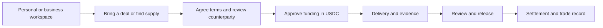
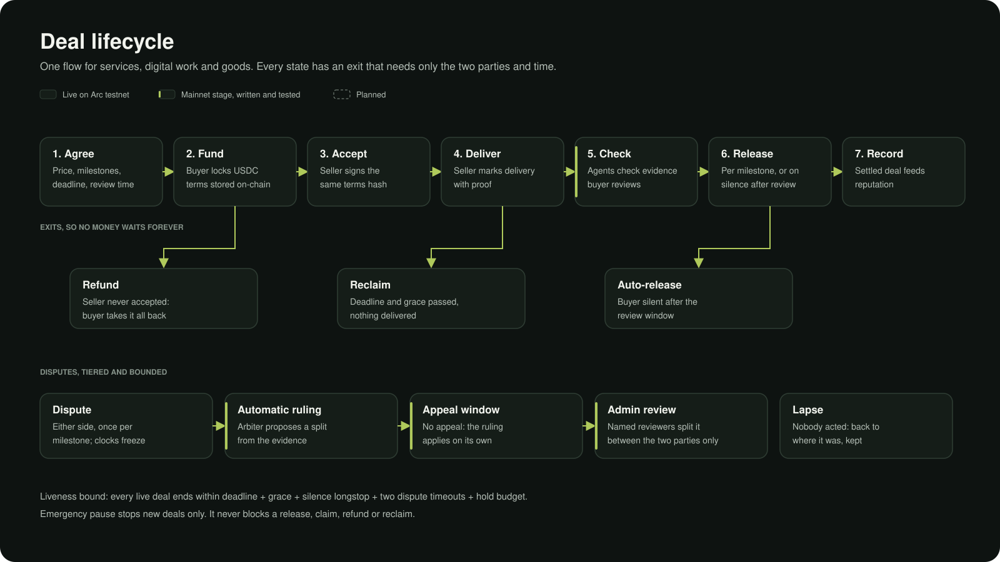
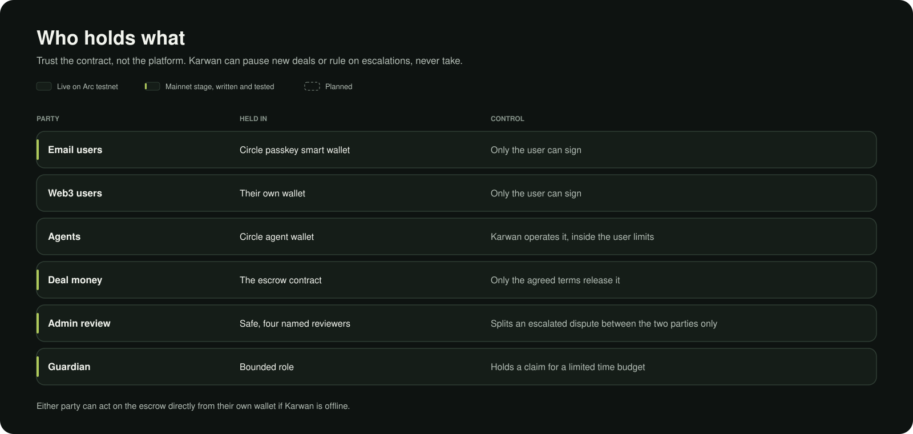
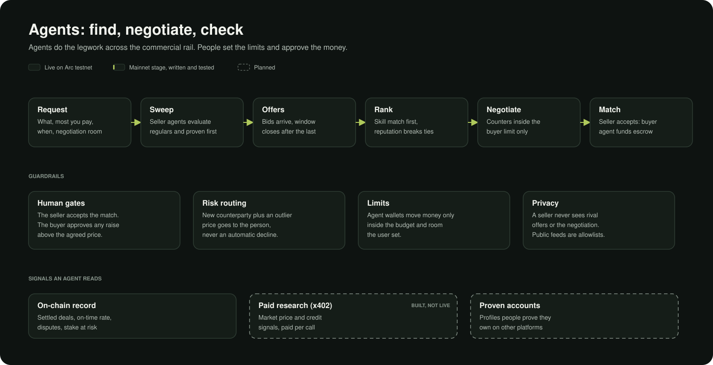
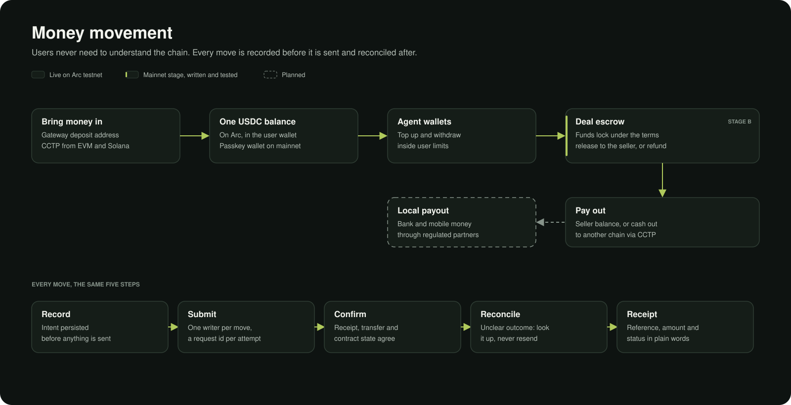

# Architecture

Last reviewed: 2026-09-25

Karwan is an open market for local and cross-border trade. The current build
uses one person identity, one login, and optional workspaces under that
identity. A personal workspace is the default. An owner can add one business
workspace without creating another account.

## System shape

- **Frontend.** Next.js 15 app with app routes, shared navigation, localized
  copy, guided tours, workspace switching, profile and business setup views,
  marketplace views, deal surfaces, wallet and bridge views, and SSE-backed
  activity updates.
- **Backend.** Hono API with authentication, profiles, workspaces, business
  verification metadata, availability records, direct deals, marketplace
  matching, agent operations, escrow coordination, wallet operations, bridge
  tracking, reputation, and durable event records.
- **Contracts.** Arc Testnet contracts provide the escrow, job board,
  reputation, vault, treasury, yield distribution, and business registry
  surfaces. Contract availability and deployment state must be checked before
  a release claim. Testnet data is not production settlement.
- **Circle stack.** Circle Developer-Controlled Wallets, Agent Wallets,
  Gateway, CCTP, and related services support the current wallet and bridge
  paths. Operational agent wallets are separate from the customer's identity
  wallet and balance.
- **Storage.** Postgres is the durable store for profile, workspace, deal,
  activity, and agent-operation metadata. A flat-file fallback supports local
  cold starts. The chain remains the source of truth for financial state.
- **Trust adapters.** Chainlink CRE handles authenticated delivery evidence and
  confidential source checks. World ID and AgentKit provide an optional
  human-backed identity signal for protected agent workflows. These adapters
  inform policy; they do not become a second escrow ledger or payment authority.

Every diagram on this page uses the same key. A plain box is live on Arc
Testnet. A box with an accent bar is written and tested for the mainnet stage
named on it, and is not live yet. A dashed box is planned, or built but not yet
exercised live, as its label says.

## Identity, workspaces, and money

The customer model is intentionally simple:

1. One person identity and one login.
2. One personal workspace by default.
3. An optional owner-only business workspace under the same identity.
4. One customer identity wallet and one USDC balance in v1.
5. Business verification is separate from personal identity verification.
6. Team permissions are planned after the owner-only MVP.

The workspace context is visible before sensitive actions. It changes the
trade context and business verification eligibility. It does not create a
second login, customer wallet, or customer balance.

The workspace API currently exposes:

- `GET /api/workspaces`
- `POST /api/workspaces/business`
- `GET /api/workspaces/:id`
- `PATCH /api/workspaces/:id`
- `GET /api/workspaces/:id/availability`
- `POST /api/workspaces/:id/availability`
- `DELETE /api/workspaces/:id/availability/:availabilityId`

Availability records describe simple goods or services a business can supply
or wants to source. They are market context, not a promise that a deal has
been funded.

## How a trade moves

Karwan supports two clear starting points:

- **Bring a deal.** Start with a known counterparty, agree the amount and
  terms, and send the deal for review.
- **Find supply.** Post what you need, or publish what you offer. The market
  and bounded agents help surface a candidate. A person reviews the proposed
  counterparty and terms before money moves.

```mermaid
flowchart LR
    A[Personal or business workspace] --> B[Bring a deal or find supply]
    B --> C[Agree terms and review counterparty]
    C --> D[Approve funding in USDC]
    D --> E[Delivery and evidence]
    E --> F[Review and release]
    F --> G[Settlement and trade record]
```

The same trade record can represent goods or services. Personal and business
workspaces share the customer identity and balance while keeping the active
workspace visible in the interface.

## Escrow

Deal money is held by the escrow contract on Arc from funding to payout, never
in a Karwan account. Today's testnet escrow follows the flow above with short
demo clocks (5-minute review times).

The mainnet escrow is designed around the deal's terms. The terms both sides
agree (milestones, delivery date, review time, extra review time, final-payment
rule, and what happens if someone goes quiet) are stored in the contract at
funding, and the seller confirms the same terms on chain. Disputes are ruled
automatically with an appeal window, and escalate to admin review, where one of
four named reviewers signs the final ruling (two of the four at or above the
high-value line). Admins can only split a disputed
amount between that deal's own parties, and a pause never blocks an exit.

This design is in review and not live. The full design, including roles,
clocks, invariants and how it is verified, is in
[escrow-design.md](./escrow-design.md).

The top row is the normal path. Each exit below it needs only the two parties
and time, so no deal can leave money waiting forever. The dispute row is the
tiered path: an automatic ruling, an appeal window, then admin review, or a
lapse back to where the deal stood if nobody acts.

## Who holds what

Users sign for their own wallets. Agent wallets act only inside the budget the
user set. Deal money sits in the escrow contract, and the admin and guardian
roles are bounded by the contract: they can split an escalated dispute between
its two parties or hold a delivery for a limited time, never pay anyone else.

## Agent boundary

Agents can search, compare, research, score, and prepare a structured offer
within the user's limits. They do not silently accept a match, fund escrow,
release money, change business verification, or change account authority.

The backend keeps agent work on a deterministic path:

1. Persist the user's intent and active workspace.
2. Gather candidate and reputation evidence.
3. Produce a versioned offer or recommendation.
4. Validate current terms, permissions, balance, and freshness.
5. Ask for human approval for a consequential action.
6. Execute an idempotent command and reconcile the provider result.
7. Persist the result and publish the ordered activity event.

Offers are ranked by skill match first; reputation only breaks ties. A seller
accepts the match and the buyer approves any raise above the agreed price.
Paid research through x402 is built but has not been exercised live.

The full reliability boundary is documented in
[agent-workflows.md](./agent-workflows.md). Rollout flags remain default-off
where a newer agent path has not completed review and reconciliation work.

## Evidence and identity boundaries

Karwan uses separate seams for separate claims:

1. **Agreement and escrow.** The parties approve versioned terms and fund USDC
   escrow on Arc Testnet.
2. **Delivery evidence.** A source adapter submits evidence bound to the current
   agreement. The Chainlink CRE path authenticates the request, checks source
   integrity, fences duplicate workers, and records the result for release policy.
3. **Participant or agent identity.** World ID staging proofs and AgentKit
   challenge checks can gate an agent or research capability. World AgentBook
   lookup refuses an unregistered agent. This signal does not approve a payment.
4. **Human decision and chain state.** A buyer reviews the accepted outcome, and
   the Arc contracts remain authoritative for funding, release, refund, and
   receipts.

The same shape works for a GitHub commit, a signed file, a carrier event, a
buyer acceptance, or another source with a clear scope and freshness rule. See
[trust-and-proof.md](./trust-and-proof.md) for the public product flow.

## Settlement and transfer rails

The chain is authoritative for balances, escrow state, releases, and final
receipts. The backend stores the terms and operation history needed to render
the product and reconcile external providers.

Circle CCTP supports configured cross-chain USDC ingress and cashout paths.
Attestation, mint, and transfer status are shown as they are known. The app
does not promise a fixed transfer time. Arc Testnet is the current development
environment, so testnet balances and receipts must be labeled accordingly.

Operational agent wallets may act in bounded background jobs where the user
has authorized that role. They are not an additional customer account and do
not replace the approval boundary for funding or settlement.

Every money move follows the same five steps: record the intent, submit once,
confirm that the receipt and contract state agree, reconcile an unclear outcome
by looking it up rather than resending, and show a plain receipt. Local bank
and mobile money payout is planned through regulated partners.

## Business workspace

The business workspace is an extension of the personal identity, not a second
profile product. The owner can add business details, complete business
verification, switch context, and then use business-focused entry points:

- **Find supply** for goods or services the business needs.
- **Post what we offer** for goods or services the business can supply.
- **Bring a deal** when a counterparty is already known.

The v1 workspace is owner-only. Team members, roles, and delegated permissions
are roadmap work and must not be described as live capability.

## Reputation and stake

Completed trade outcomes feed the current reputation model. Evidence coverage,
trade history, and stake are shown separately so a score is not presented as
an all-purpose safety guarantee. See [reputation-model.md](./reputation-model.md)
and [work-verification.md](./work-verification.md).

## Documentation boundary

This file describes the current public product shape. Internal plans,
research, submission records, audits, and internal planning materials are intentionally
excluded from the public documentation set. Public pages must say when a
capability is planned, testnet-only, owner-only, or not yet verified.
