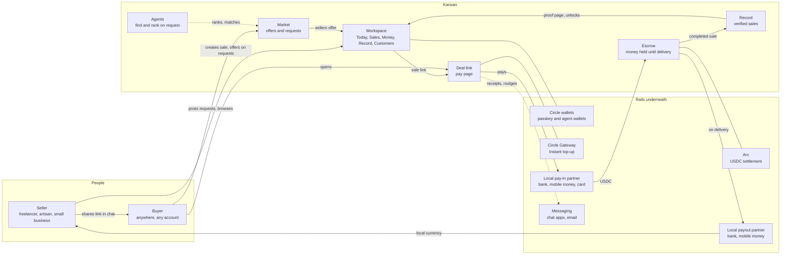
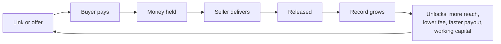

# 01 · Workspace

The workspace is where a seller runs their trade: today's orders, new sale links, money, their record and their customers. Buyers never need the workspace; they meet Karwan through a link or the market.

## Context

## The loop that makes it a product

The top of the loop (hold and release) is infrastructure nobody pays for directly. The bottom (record and unlocks) is why a seller keeps coming back.

## Status

| Part | Status | Where |
|---|---|---|
| Market with offers and requests | Live (testnet) | `frontend/features/listings`, `backend/src/routes/listings.ts`, `jobs.ts` |
| Escrow, release, disputes | Live | `contracts/`, `backend/src/agents/dealWatcher.ts` |
| Passkey accounts (mainnet) and agent wallets | Live | `frontend/features/modularWallet`, `backend/src/db/agentWallets.ts` |
| Direct offers on requests | Built | [03](03-direct-offers.md) |
| Workspace tabs (Today, Sales, Money, Record, Customers) | Planned | spec: seller workspace |
| Local pay-in and payout partners | Planned | chosen per country, see research log |
| Messaging receipts and nudges | Planned | |
| Record that unlocks money | Planned | [06](06-record.md) |
