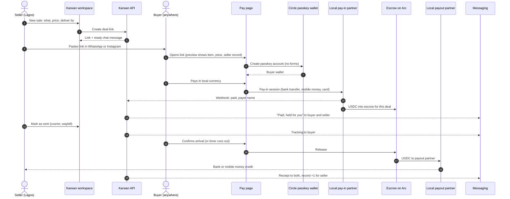

# 02 · Deal link

A seller makes one link for one sale and pastes it into a chat. The buyer, who may never have heard of Karwan, pays with what they already use. The money is held until the item or work arrives, then paid out to the seller in their own currency.

## Sequence

## What can go wrong

| Step | Failure | What happens |
|---|---|---|
| 7-8 | Buyer abandons passkey or payment | Link stays open; seller can nudge from Today |
| 9-10 | Pay-in webhook delayed | Pay page shows "Confirming your payment"; never shows failed until the partner says so |
| 11 | USDC does not reach escrow | Money movement ledger records it; reconciler retries; buyer refunded if it cannot complete |
| 14-15 | Buyer says nothing | Auto-release after the stated window (shown to the buyer before paying) |
| 15 | Buyer reports a problem | Seller first (photos, 48h reply, refund, fix or swap), then Karwan dispute |
| 16-17 | Payout partner fails | Balance stays in the seller's Karwan balance; payout retried; seller told plainly |

## Status

| Step | Status | Notes |
|---|---|---|
| Deal created with a shareable invite link | Live | `POST /api/deals/direct` with seller email creates a pending invite; `/invite/[token]` claim (`backend/src/deals/inviteClaim.ts`) |
| Counterparty signs in to claim | Live | email or passkey session; wallet-verified email also works |
| Escrow hold, delivery, release, auto-release, disputes | Live | USDC on Arc |
| Seller-first sale link (what, price, deliver by) and chat message | Planned | replaces "invite a counterparty" wording for sellers |
| Buyer pays without a pre-existing account | Planned | passkey created inside the pay step |
| Local currency pay-in | Planned | partner per country; Circle Onramp Kit is a candidate for card and bank |
| Local currency payout | Planned | partner per country; Circle Payments Network where eligible |
| Messaging receipts and nudges | Planned | |
| Record +1 on release | Planned | [06](06-record.md) |
