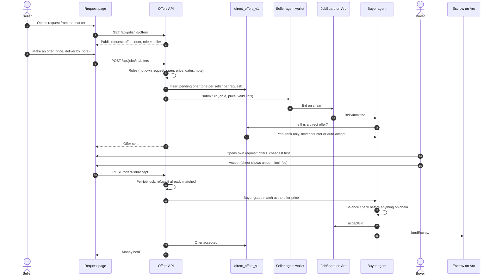

# 03 · Direct offers

A seller who finds a request in the market can offer on it directly, at their own price and date, without waiting for an agent match. The buyer sees every offer with the seller's record and decides.

## Sequence

## Guards

| Risk | Guard |
|---|---|
| Double send | One pending offer per seller per request; a retry returns the first offer, no second bid |
| Request closed between load and send | Bid reads job state first; offer ends `failed` with a clear message; seller may retry |
| Seller already bidding through an agent | Refused (`ALREADY_BIDDING`); listing auto-bids skip a seller with a pending direct offer |
| Buyer short on funds | Nothing on chain; 409 top-up; the temporary match is removed |
| Two accepts at once, or agent match approving | Shared per-job lock with agent approvals; approved match refuses a new accept |
| Offer expires | Lapses at 7 days or the request deadline; a lapsed offer never blocks a new one |
| Privacy | Buyer sees all offers; a seller sees their own; everyone else sees only the count |

## Status

| Part | Status | Where |
|---|---|---|
| Rules, store, migration 35 | Built | `backend/src/offers/`, `backend/src/db/directOffers.ts` |
| Seller bid, buyer agent guard | Built | `backend/src/agents/seller.ts`, `buyer.ts` |
| Routes | Built | `backend/src/routes/offers.ts` |
| Request page, offer sheet, buyer list | Built | `frontend/features/offers/` |
| Agent ranking of direct offers by skill match | Planned | today sorted by price |
| Sibling offers closed when a request funds | Planned | |
| First real testnet offer | Pending | after deploy |
