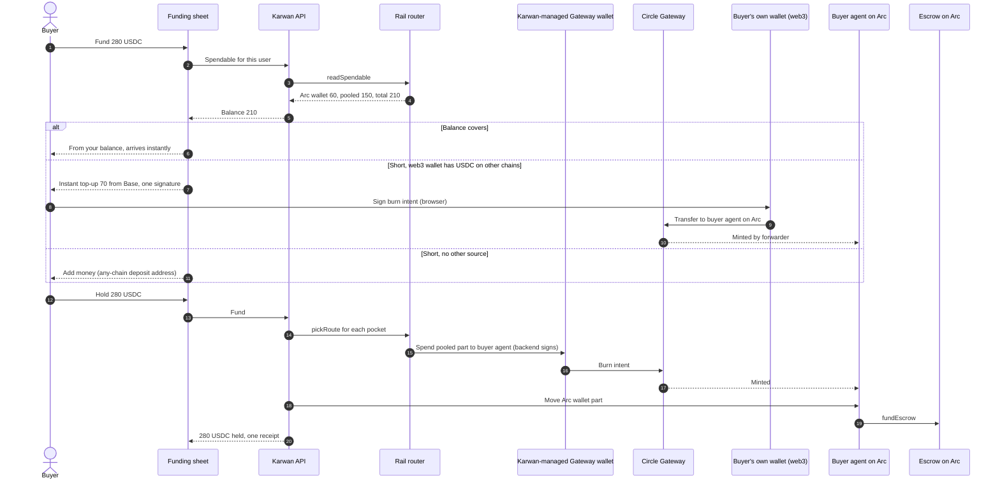

# 04 · Instant top-up

A buyer whose money is not all on Arc funds a deal in one step. The user sees one balance and, when it helps, "Instant top-up" inside funding. Circle Gateway does the work underneath and is never named in the product.

## Where the money can sit

The product shows one balance. Underneath, a user's USDC can be in three places:

| Pocket | Who signs | Every account type? |
|---|---|---|
| Arc identity wallet | the user (passkey smart account, or their own wallet) | yes |
| Karwan-managed pooled balance: a per-user Gateway wallet, a Circle developer-controlled plain wallet | Karwan's backend signs its own burn intents, no delegate needed | yes |
| The user's own wallet's Gateway balance on other chains | the user's wallet (web3 only) | web3 wallets only |

`backend/src/gateway/router.ts` reads the first two as one total (`readSpendable`) and picks the rail per move (`pickRoute`). The pooled balance counts toward the total and is never shown as a second balance.

## Sequence: funding a deal

## Rules

- One balance in copy. The pooled balance is never shown, named, or offered as a place to put money.
- "Instant top-up" names the moment money comes in from another chain inside funding. No Gateway page, card, tab or tour step.
- The funding sheet states the split and fee before any signature; if the quote changes, it asks again.
- Each move is one money movement with one receipt.

## Open decision

Today `pickRoute` returns `insufficient` when no single pocket covers the amount; it never combines pockets. Funding from Arc wallet plus pooled balance in one press needs a two-leg move with a clear recovery if the second leg fails.

## Status

| Part | Status | Where |
|---|---|---|
| One-balance read and rail router | Live | `backend/src/gateway/router.ts` (used by the assistant) |
| Backend spend from the Karwan-managed Gateway wallet to an agent | Live | `POST /api/gateway/fund-agent`, `backend/src/gateway/spend.ts` |
| Browser spend from the user's own wallet | Built | `frontend/features/gateway/lib.ts` |
| Any-chain deposit address landing on Arc | Live | `backend/src/circle/depositWatcher.ts`, `depositRouter.ts` |
| Gateway shown to users (balance card, bridge tab, "pool" copy, tour step) | Live, to be removed | `GatewayBalanceCard`, `app/bridge`, `TopUpFromGateway`, `ArcFundCard` |
| Instant top-up inside the deal and request funding sheets | Planned | spec Part B |
| Two-leg funding across pockets | Planned | open decision above |
