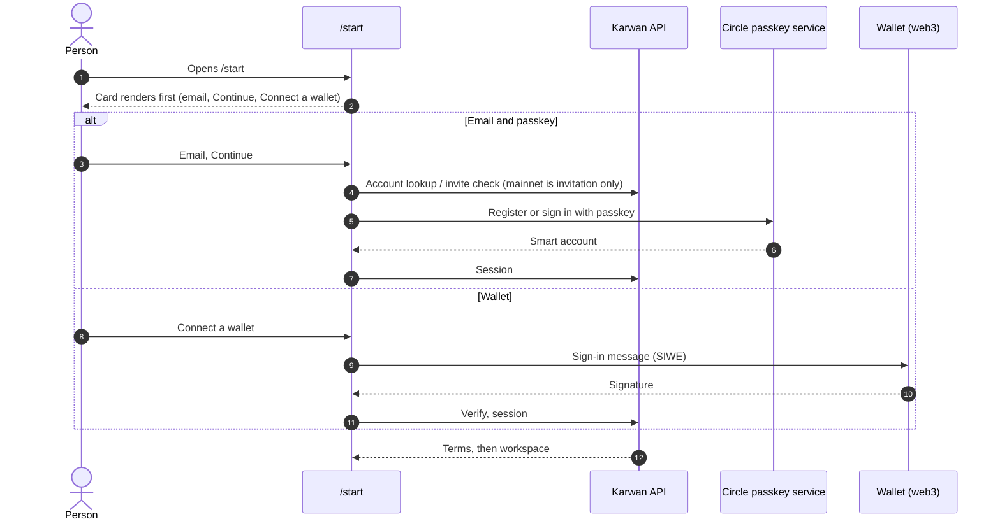
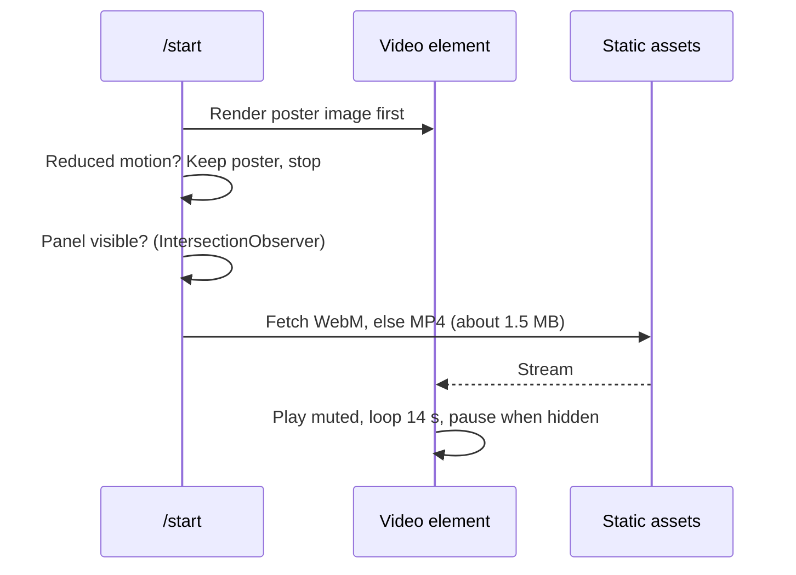

# 05 · Sign-in and motion

A person gets in with an email and a passkey, or a wallet. The sign-in page shows a short looping film of Karwan's own objects. The film never slows the sign-in down.

## Sign-in

## Motion loading

## The film

14 seconds, seamless: deal cards drift in; two meet and fold into a capsule sealed with a lime line; the capsule opens and a coin settles on the record stack, which grows by one; everything drifts back. Four objects modelled once in 3D in code, one matte material, palette colours only. No AI imagery or stock 3D.

Approval gates: still frames, then a 6 to 8 second motion study, then the full loop.

## Status

| Part | Status |
|---|---|
| Email, passkey and wallet sign-in | Live |
| Redesigned sign-in layout | Planned (spec Part C) |
| Poster-first, visible-only film loading | Planned |
| 3D objects and film | Planned, gated |
