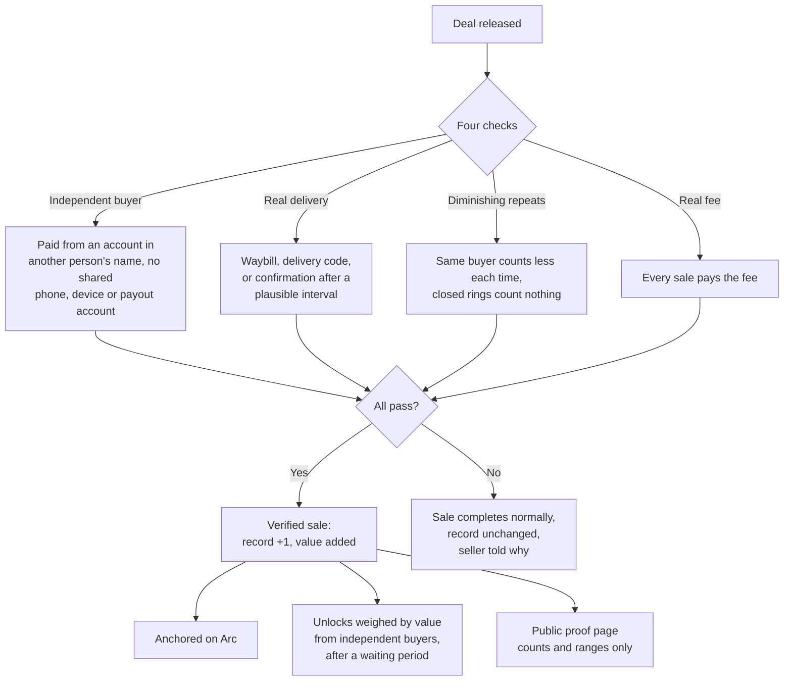

# 06 · Record

Every completed sale can raise the seller's record. The record is shown on a public proof page and unlocks cheaper and faster money. Because it is worth something, it must be expensive to fake.

## From sale to record

## Privacy

The public page never shows buyer names, exact amounts, addresses or phone numbers. Prices appear as ranges. The seller chooses which sections are public.

## Status

| Part | Status |
|---|---|
| Reputation engine and registries | Live (agent-based reputation) |
| Four checks per sale | Planned |
| Proof page | Planned |
| Unlocks (fee, payout speed, working capital) | Planned |
