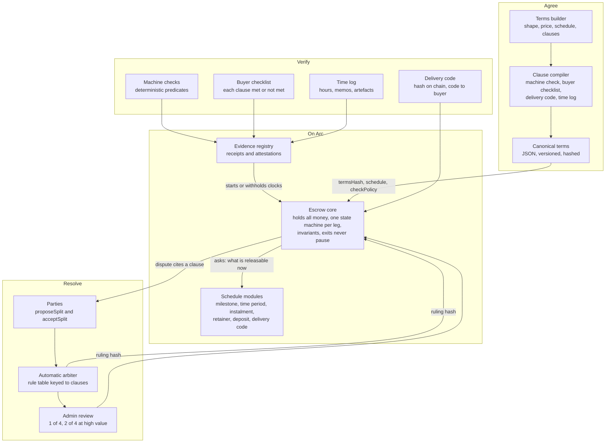
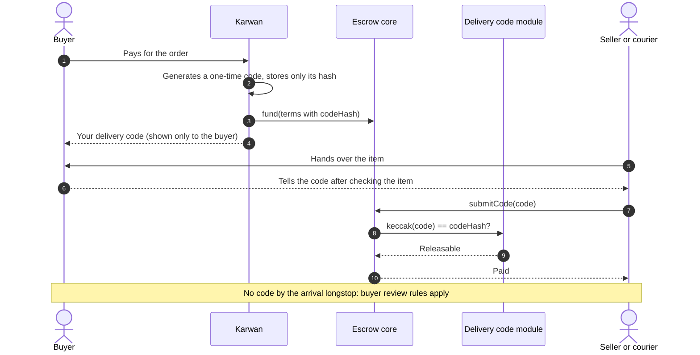
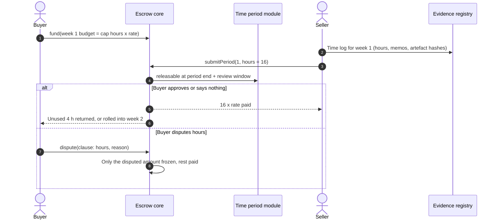
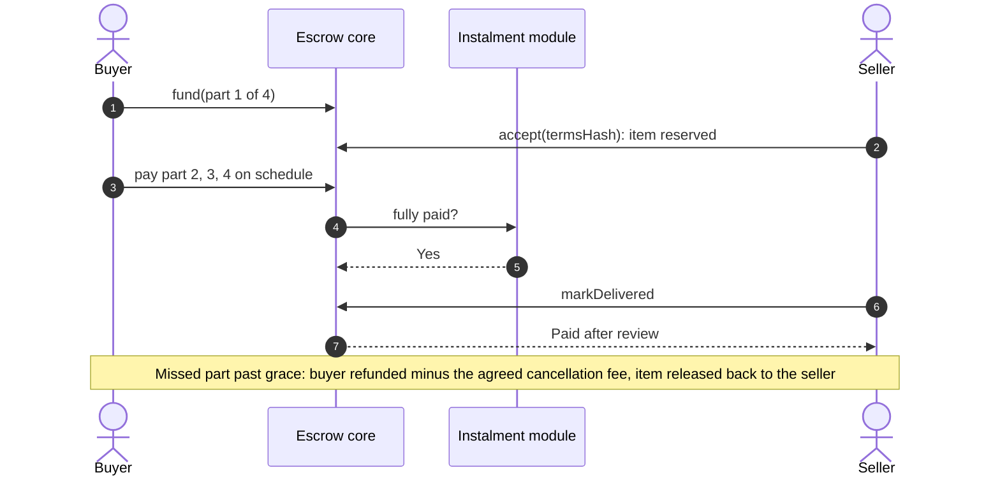

# 07 · Escrow: one engine for any deal

Every deal on Karwan, from a 3,000 naira phone case to a six-month software retainer, ends in the same place: money held by a contract, released only by the terms both sides agreed. This view designs that engine so it holds any kind of deal, lets the buyer verify each term by hand when no machine can, and gives an arbiter a clear rule for every dispute.

It extends the terms-driven design in [`docs/escrow-design.md`](../escrow-design.md) (the v3 `KarwanDealEscrow`). Everything that document fixes (terms hash consent, clocks that only move forward, one dispute per side per milestone, exits that never pause, owed credits, caps) stays. What this view adds: payment **schedules** beyond fixed milestones, **verification modes** per term, and a **dispute rule table** keyed to the terms.

## 1. The deals people actually make

Looked at from emerging markets first, where cash on delivery, "pay small small", mobile money and chat-based selling are normal.

| Shape | Example | How money should move | Today |
|---|---|---|---|
| Instant one-time | A logo file, a phone case | Paid now, held briefly, released on confirmation or a short timer | v3 single milestone |
| Fixed price, milestones | Website in three stages | Funded upfront, released stage by stage after review | v3, up to 5 milestones |
| Physical goods with delivery | Wig from Lagos to Abuja | Held until the buyer has the item; review starts on arrival | v3 `ON_ARRIVAL` |
| Pay on delivery, prepaid | Replaces cash on delivery | Held until the buyer hands a one-time delivery code to the courier or seller | Planned |
| Hourly or weekly time | Virtual assistant, 20 h a week at 8 USDC | Weekly budget held; hours submitted with a work log; buyer reviews; approved hours paid, unused returned or rolled | Planned |
| Retainer or subscription | Monthly social media management | One period funded at a time; paid at period end unless disputed; either side can end with notice | Planned |
| Instalments, lay-by | Fridge paid in four parts | Buyer pays in parts into escrow; goods released when fully paid; cancellation rule agreed upfront | Planned |
| Refundable deposit | Equipment rental, booking | Held and returned at the end unless the seller's claim holds | v3 `silenceOutcome = 1` |
| Business order, net terms | 200 T-shirts, Net 30 | Held; review lasts the net term; financing can advance the seller | v3 net preset, `KarwanPOFinancing` |

## 2. Architecture

### Why a core with schedule modules

| Option | For | Against |
|---|---|---|
| A. Grow the v3 terms struct to cover every shape | One contract to audit | Bytecode limit, and every new shape touches the audited core |
| **B. Core holds money, schedule modules compute what is releasable (chosen)** | Money and invariants stay in one audited place; a new shape is a new module, audited alone; modules hold nothing | An interface to get right once; a module allowlist governed by the owner Safe with a timelock |
| C. A separate escrow per shape | Simple per contract | Invariants duplicated; money spread across contracts; harder to reason about in total |

Rules for modules: a module is a pure view contract. It returns, for a leg at a moment in time, how much the seller may claim, how much the buyer may take back, and which clock applies. It cannot hold, move or approve money. The core enforces conservation (`in == out`), final-state absorption and the recipient allowlist whatever a module says. Modules are immutable; a changed rule is a new module version, and a funded deal keeps the module it was funded with.

## 3. Terms are what everything is checked against

A term is a clause both sides agreed, stored in the canonical terms and bound into `termsHash` before any money moves. Each clause gets one verification mode when the terms are compiled:

| Mode | When | Who decides | Example clause |
|---|---|---|---|
| Machine check | The clause is testable from evidence | A deterministic predicate; a model may only advise | "Merged pull request to `main` with passing CI" |
| Buyer checklist | A person has to look | The buyer marks the clause met or not met, with a reason and photos | "Wig is 22 inch, body wave, black" |
| Delivery code | Physical handover | The buyer gives a one-time code at handover; the seller or courier submits it | "Delivered to the buyer in person" |
| Time log | Hourly work | Hours, memos and artefacts per period, reviewed by the buyer | "Up to 20 hours a week on bookkeeping" |
| Clock only | Nothing to test | The review window and silence rule | "Available for questions for 7 days" |

The buyer's review screen is the terms as a checklist. Releasing means every clause is met. Disputing means naming the clause that was not met and why. A dispute that cites no clause is refused by the app, so every dispute an arbiter sees is about a specific promise.

## 4. Sequences for the new shapes

### Pay on delivery, prepaid

### Hourly work, weekly

### Instalments, lay-by

## 5. Disputes an arbiter can decide

Every dispute cites a clause. The automatic arbiter reads the terms, the clocks and the evidence, and applies a table like this. Anything outside the table escalates to admin review.

| Situation | Evidence | Proposed ruling |
|---|---|---|
| Nothing delivered by deadline + grace | No delivery mark | Full refund to the buyer |
| Delivered on time, machine check passed, buyer cites no failed clause | Receipt for this revision | Seller paid |
| Machine check failed on the cited clause for this revision | Mismatch receipt | Buyer refunded for that leg |
| Delivery code submitted | Code matched on chain | Seller paid; dispute refused |
| Hours disputed, time log shows activity for the claimed hours | Log hashes, artefacts | Seller paid for logged hours with artefacts; the rest escalates |
| Buyer checklist: clause not met, with photos, seller does not respond in 48 h | Checklist, photos, silence | Refund or agreed partial |
| Both sides have evidence on a subjective clause | Conflicting | Escalate to admin review |

Rulings only ever split a leg's unreleased money between the two parties, carry a ruling hash, and take effect after the appeal window unless a side escalates. The meta-evidence for every dispute is the canonical terms, in the same spirit as the ERC-1497 evidence standard.

## 6. Emerging-market requirements

- **Local money in and out.** Buyers pay in naira, shillings or cedis through local partners; the escrow only ever holds USDC; each deal records the FX rate and fee at funding so a refund returns the same local amount where the partner allows, and states when it cannot.
- **Low data, chat first.** Every step has a short link and a plain message fit for WhatsApp or SMS; the delivery code works read aloud.
- **Couriers without apps.** The delivery code can be entered by the seller on the courier's behalf.
- **Small amounts.** Fees and clocks fit a 5 USDC sale as well as a 5,000 USDC order; the caps from the v3 design apply.
- **Cancellation on unreliable schedules.** Every shape states upfront what happens if the other side goes quiet.

## 7. Invariants added to the v3 set

| ID | Invariant |
|---|---|
| I18 | A schedule module never moves money; removing every module call leaves conservation intact |
| I19 | Per leg: paid to seller + returned to buyer + fees + owed == funded for that leg |
| I20 | A delivery code releases at most its own leg, once |
| I21 | A time-period leg never pays more than cap hours x rate for that period |
| I22 | An instalment deal never pays the seller before the last part is funded |
| I23 | A dispute freezes only the disputed leg's unreleased amount |
| I24 | A funded deal keeps its module version for life |

## 8. What exists and what comes

| Piece | Status | Where |
|---|---|---|
| Terms struct, hash consent, milestones, review, extensions, silence outcome, refundable deposit | Built (v3) | `contracts/src/KarwanDealEscrow.sol`, `KarwanDealTypes.sol` |
| Arrival review for goods | Built (v3) | `reviewStarts = 1` |
| Machine check with evidence receipts | Built (GitHub pilot) | `KarwanEvidenceRegistry.sol`, `backend/src/deals/deliveryEvidence.ts` |
| Automatic arbiter rules, appeal, admin review | Built (v3) | `backend/src/deals/arbiterV3.ts` |
| Live escrow for today's deals | Live (v2b) | `KarwanEscrow.sol` |
| Canonical terms JSON and clause compiler | Planned | |
| Buyer checklist review and clause-cited disputes | Planned | |
| Schedule module interface and allowlist | Planned | |
| Delivery code module | Planned | |
| Time period module (hourly, weekly) | Planned | |
| Instalment module | Planned | |
| Retainer module | Planned | |
| Streaming for trusted retainers | Later | Sablier Flow style, only after the period model proves out |

## 9. Sources from the wider lookup

- Circle, [Refund Protocol](https://www.circle.com/blog/refund-protocol-non-custodial-dispute-resolution-for-stablecoin-payments): lockup, refund address fixed at payment, arbiter cannot send funds elsewhere. Karwan's rule that rulings only split between the two parties follows the same principle.
- Upwork, [hourly payment protection](https://support.upwork.com/hc/en-us/articles/211068288-How-Hourly-Payment-Protection-works-for-freelancers) and [weekly billing](https://support.upwork.com/hc/en-us/articles/211063698-How-to-manage-the-weekly-billing-cycle): weekly cap, work diary, five-day review, disputes on hours.
- Escrow.com, [milestones](https://www.escrow.com/milestones/how-it-works) and [inspection period](https://www.escrow.com/inspection-period): fully funded upfront, inspection per milestone, release on silence.
- Sablier, [Flow](https://docs.sablier.com/concepts/flow/overview): open-ended per-second streams that can be paused, adjusted and topped up.
- UMA, [Optimistic Oracle v3](https://docs.uma.xyz/developers/optimistic-oracle-v3): assert, liveness window, dispute with a bond; the pattern behind the appeal window.
- Kleros, [ERC-792 arbitration](https://docs.kleros.io/developer/arbitration-development/erc-792-arbitration-standard) and [ERC-1497 evidence](https://docs.kleros.io/developer/arbitration-development/erc-1497-evidence-standard): arbitrable and arbitrator separation, meta-evidence as the agreement.
- Nigeria: [Vesicash](https://techpoint.africa/feature/vesicash-escrow-services/) (escrow API since 2019), [EscrowPay](https://techpoint.africa/brandpress/escrowpay-launches-whatsapp-native-escrow/) (WhatsApp-native escrow, 2026), and [cash on delivery being withdrawn by large retailers](https://www.mondaq.com/nigeria/financial-services/1474486/the-emergence-of-escrow-payments-in-e-commerce-transactions-in-nigeria).
- Kenya: M-Pesa escrow services such as [eConfirm](https://econfirm.co.ke/) and [Escrow Kenya](https://www.kenyaescrow.com/) (STK push into escrow, release on confirmation, about 3% fee).
- Instalments: [digital lay-by in South Africa](https://www.gwebdesign.co.za/informal-lay-by-2-0-digitalizing-traditional-south-african-payment-models-for-modern-online-retail/) and [Africa BNPL growth](https://www.ecofinagency.com/news/1802-52998-africa-s-buy-now-pay-later-market-to-triple-to-16-8-billion-by-2031-report-says).
