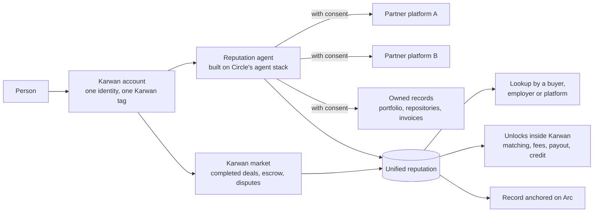
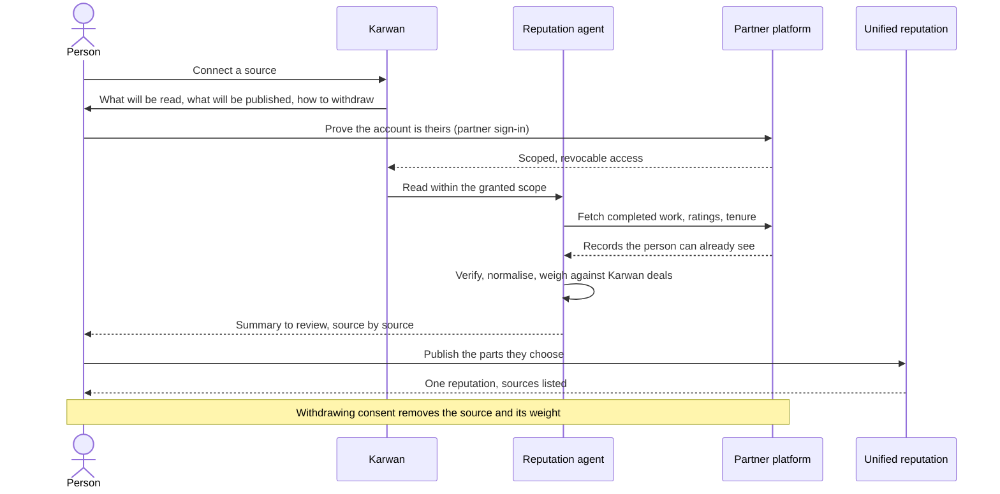

# 08 · Unified reputation

The direction everything else serves. People join a new marketplace, job board or region and have to prove themselves from zero every time, because their record is split across platforms that do not talk to each other. Karwan brings that record together into one reputation that travels with the person: easy to track, easy to look up, hard to fake. It starts with Karwan's own market (views 02, 03, 06, 07), where every completed deal is already recorded.

This view is the working model we are designing. Nothing below the Karwan market line is live, and no outside platform is named as a partner until an agreement exists.

## Principles

1. **Your data, your permission.** Agents only work with data a person already owns, and only after they connect it and say yes. Consent is scoped to one source and can be withdrawn at any time.
2. **Nothing leaks.** Raw data from a source never leaves the person's control and is never sold, shared or used to train anything. What is published is a summary the person reviewed.
3. **Partners, not scraping.** Other platforms join as partners through their own interfaces, contacted when the working model is designed with them. No scraping, no logging in on someone's behalf, no reading data a person cannot already see.
4. **Earned, not claimed.** A source counts only if it can be verified. A platform Karwan cannot verify adds no score. Karwan's own completed deals carry the most weight because the money, the delivery and the outcome are all on record.
5. **One record, many uses.** The same reputation opens matching, lower fees, faster payout and working capital inside Karwan, and can be looked up by anyone the person shares it with.

## Participants

## Connecting a source

## Looking someone up

A buyer, employer or platform looks up a Karwan tag and sees one page: completed Karwan deals, verified sources with their weight, how long each has been held, and nothing the person chose to keep private. Prices show as ranges; names of past clients never appear.

## What fails where

| Failure | What happens |
|---|---|
| A source cannot be verified | It is listed as unverified and adds nothing |
| A partner withdraws access | The source goes stale, loses weight after a stated period, and the person is told |
| A person withdraws consent | The source and its weight are removed at once |
| A source and Karwan deals disagree | Karwan deals win; the conflict is shown, not hidden |
| An agent read fails | The last good summary stays; nothing is invented to fill the gap |

## Research we are doing

- How people vet themselves today across freelance markets, job boards, trade platforms and regions, and what a counterparty actually checks before paying.
- Which signals predict a good outcome and which are easy to fake.
- What a partner platform needs to share a record safely, and what it gains.
- How the agent is paid for the reads it makes, using Circle's agent payment tools, without charging the person for their own data.

## Status

| Part | Status |
|---|---|
| Karwan market record: completed deals, escrow, disputes, reputation on Arc | Live on testnet |
| Karwan tag as the one handle to look someone up | Built |
| Public lookup page | Planned (view 06) |
| Reputation agent on Circle's agent stack | Designing |
| Source connection, consent and withdrawal | Designing |
| Partner platforms | Research; none named until an agreement exists |
