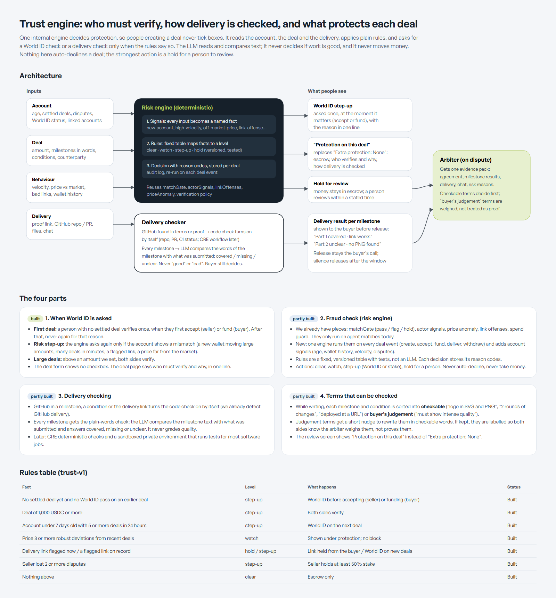
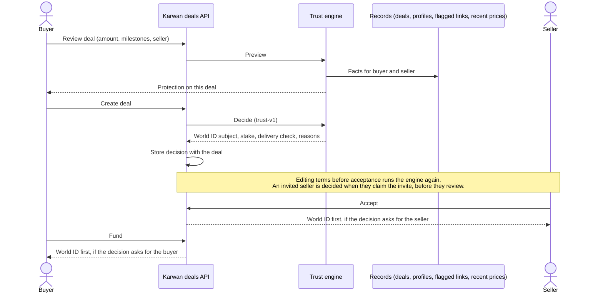

# 09 · Trust engine

Protection on a deal is decided by Karwan, not ticked by the people making it. One internal engine reads each person's record and the deal, applies a fixed table of rules, and asks for a World ID check, a seller stake or a GitHub delivery check only when a rule says so. Plain rules decide; no language model is involved in the decision. Nothing here declines a deal or moves money. The strongest outcome is a step-up, and a flagged delivery link is held back from the buyer until a person reviews it.

## Principles

1. **No switches for people.** The deal form has no World ID or evidence checkboxes. The engine decides, and the deal page says what it decided and why, in one line per fact.
2. **Ask once, at the moment it matters.** A person on their first deal verifies with World ID before they accept (seller) or fund (buyer). After one pass, the first-deal rule never asks them again.
3. **Rules, not models.** Every decision comes from a versioned rules table (`trust-v1`) with tests. Each decision is stored on the deal with its reason codes, so it can be explained and replayed.
4. **Only ever adds protection.** A later decision can add a party to the World ID check, turn the delivery check on or raise the stake share. It never removes something the buyer or an earlier decision asked for.
5. **Each side sees its own reasons.** The counterparty learns that the other person verifies, not why, unless the reason is shared by the deal (first deal, large deal).

## Where it runs

The World ID check reuses the deal-level gate that already existed (`highSignalVerification`), so accept and fund are blocked in exactly one place. The delivery check reuses the GitHub evidence path (`evidenceRequired`), and the stake reuses the deal's `requireStake`.

## Rules table (trust-v1)

| Fact | Level | What happens | Status |
|---|---|---|---|
| No settled deal and no World ID pass on an earlier deal | step-up | World ID before accepting (seller) or funding (buyer) | Built |
| Deal of 1,000 USDC or more | step-up | Both sides verify | Built |
| Account under 7 days old with 5 or more deals in 24 hours | step-up | World ID on the next deal | Built |
| A flagged link on the person's record | step-up | World ID on new deals | Built |
| Delivery link flagged on this deal | hold | Link held back from the buyer until reviewed | Live (existing) |
| Seller lost 2 or more disputes | step-up | Seller holds at least 50% stake | Built |
| Price 3 or more robust deviations from recent deals | watch | Shown under protection; no block | Built |
| Agreement names a GitHub repository, pull request or commit | check | Delivery checked against GitHub | Built |
| Nothing above | clear | Escrow only | Built |

Where World ID is not configured, nobody is asked; the reasons are still stored.

## What people see

- **Review step:** a "Protection on this deal" row built from a preview of the decision: escrow, who verifies with World ID and why, stake, GitHub check, a price note.
- **Deal page:** the same section, plus the World ID step for the person who must verify.

## Planned

| Step | Status |
|---|---|
| Run the engine on fund, deliver and withdraw, not only create, edit and claim | Planned |
| Per-milestone delivery read: compares the milestone's words with what was delivered and answers covered, missing or unclear. It never grades quality, and the buyer still decides | Planned |
| Terms that can be checked: while writing, each milestone and condition is marked checkable or the buyer's judgement, with a nudge to rewrite judgement terms | Planned |
| Evidence pack for the arbiter: agreement, milestone results, delivery, chat and stored reasons, with checkable terms weighed first | Planned |
| Sandboxed test runs for software jobs (CRE) | Planned |

## Code

- `backend/src/trust/riskEngine.ts`: the rules, limits, reason codes and the per-viewer projection.
- `backend/src/trust/trustFacts.ts`: facts from deals, profiles and flagged links.
- `backend/src/trust/applyDecision.ts`: turns a decision into deal fields, never lowering protection.
- `backend/src/trust/dealTrust.ts`: runs the engine for one deal.
- `POST /api/deals/direct/protection`: the review-step preview.
